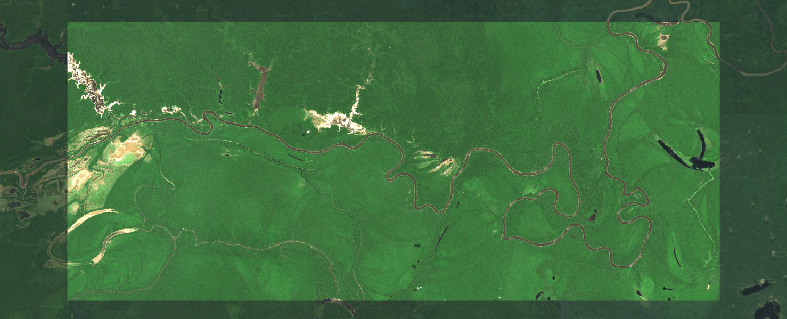

```{r setup, include = FALSE}
knitr::opts_chunk$set(
  collapse = TRUE,
  comment = "#>",
  eval=FALSE
)
options(rmarkdown.html_vignette.check_title = FALSE)
```

`biodivMapR` produces spectral diversity maps from raster data.
Its application is technically not limited to optical imagery. 
Users experimenting with other types of remote sensing data are invited to ensure 
that the input information provided for remotely sensed diversity mapping are 
'ecologically relevant' features describing vegetation biodiversity as expected
in `biodivMapR`.

Raster data are mainly handled with the R package 
[`terra`](https://rspatial.github.io/terra/reference/terra-package.html).
Data format should be compliant with the drivers available with this package.
Use `gdal(drivers=TRUE)` to check which drivers are available in your 
installation.

Here, Sentinel-2 imagery is used to illustrate the main functionalities 
of `biodivMapR`.
This tutorial will first guide you through the download of Sentinel-2 data with 
R packages .

## access Sentinel-2 imagery with `preprocS2`

[`preprocS2`](https://gitlab.com/jbferet/preprocs2) is a package dedicated to 
Sentinel-2 data handling, which provides access to Spatio Temporal Asset 
Catalogs ([STAC](https://stacspec.org/en)) via R scripts. 
It including wrapper functions for the 
[`rstac`](https://brazil-data-cube.github.io/rstac/) package.
It allows downloading and preparing Sentinel-2 images for further processings 
using `biodivMapR`.

The STAC specification is a common language to describe geospatial information.
STAC resources are available online from various institutional and private 
providers (such as Copernicus dataspace and Nicrosoft Planetary Computers). 
STAC catalogs provides access to imagery data via spatio-temporal queries. 
Hence, the first step is to define an area of interest (aoi), and a period or 
day of interest. 

The default STAC collection is `sentinel-2-l2a` from the **[`Microsoft Planetary Computer`](https://planetarycomputer.microsoft.com/dataset/sentinel-2-l2a)** 
catalog.

Optionally, `preprocS2` can download the geometry of acquisition (sun & view 
angles) corresponding to the Sentinel-2 acquisition.
Access to geometry of acquisition is provided by the package 
[`CDSE`](https://zivankaraman.github.io/CDSE/).

Please follow instructions for proper installation of the package, and provide 
authentication for CDSE if you want to get geometry of acquisition by activating 
OAuth clients following 
[`this link`](https://shapps.dataspace.copernicus.eu/dashboard/#/account/settings).


### spatial extent: define an area of interest (aoi)

First, load required packages and prepare input and output directories.


```{r prepare download s2}
# clean workspace
rm(list = ls(all=TRUE)); gc()
if (rstudioapi::isAvailable()) 
  setwd(dirname(rstudioapi::getSourceEditorContext()$path))
library(preprocS2)  # install instructions: https://github.com/jbferet/preprocS2
library(biodivMapR) # install instructions: https://github.com/jbferet/biodivMapR
library(spinR)      # install instructions: https://github.com/jbferet/spinR
library(terra)
library(sf)
# 1.1- define input & output directories
input_dir_vect <- './01_DATA/amazon/vector_data'
input_dir_rast <- './01_DATA/amazon/raster_data/sentinel-2'
dir.create(path = input_dir_rast, showWarnings = F, recursive = T)
dir.create(path = input_dir_vect, showWarnings = F, recursive = T)
```


The spatial extent of the area of interest (aoi) needs to be defined as a vector 
file. 
Such aoi can be defined with `QGIS`, `Google Earth`, or your favorite tool. 

Here an aoi located in Brazilian Amazon forest is defined. 
The site is located next to **Guedes, Japurá - State of Amazonas, Brazil**. 


```{r, eval=FALSE}
# 1.2- define area of interest
bbox <- sf::st_bbox(obj = c('xmin' = -66.23, 'ymin' = -2.11, 
                            'xmax' = -65.76, 'ymax' = -1.91))
sf::st_crs(x = bbox) <- 4326
aoi_path <- file.path(input_dir_vect, 'amazon.gpkg')
sf::st_write(obj = bbox_to_poly(x = bbox), dsn = aoi_path, 
             driver = 'GPKG', delete_layer = TRUE)
```


### time range: define a date of acquisition

A Sentinel-2 acquisition with minimal cloud cover needs to be identified. 
The [Copernicus Browser](https://browser.dataspace.copernicus.eu) is a useful 
service to explore the availability of Sentinel-2 acquisitions. 
In addition to spatio-temporal filters, it includes filters such as the maximum 
cloud cover.

Images with a maximum cloud cover  < 5%, are identified for August 2024. 
An acquisition from 23 August 2024 shows good conditions of acquisition. 

### download Sentinel-2 acquisition from online STAC resource

`preprocS2` allows downloading from multiple providers. 
Microsoft Planetary computer is currently the default option. 

The function `get_s2_raster` downloads Sentinel-2 data corresponding to the
spatio-temporal query. 

- `aoi_path`: path for vector layer. Must include a **unique polygon** 
- `datetime`: date of acquisition, provided as a _Date_ object.
- `stac_info`: list including provider identifier (default = `mpc`)
- `output_dir`: output directory where to store data
- `site_name`: this will allow identifying rasters later
- `options`: options including maximum cloud cover and higher level processing

```{r, eval=FALSE}
# 1.4- download  S2 acquisition
datetime <- as.Date('2024-08-23')
stac_info <- list('provider' = 'mpc')
site_name = 'amazon'
options <- set_options_preprocS2(fun = 'get_s2_raster')
options$overwrite <- FALSE
list_files <- get_s2_raster(aoi_path = aoi_path, 
                            datetime = datetime, 
                            stac_info = stac_info, 
                            output_dir = input_dir_rast, 
                            site_name = site_name, 
                            options = options)

rast_path <- list_files$Refl_L2A                # S2 L2A reflectance
mask_path <- list_files$vegetation_mask         # S2 binary mask identifying vegetation, discarding clouds & shadows
```

The information resulting from the spatiotemporal query are saved in the 
directory defined with the variable `input_dir_rast`. 
It follows this file/folder structure: 

```
├── collections
    ├── plot_001.rds
├── raster_samples
    ├── amazon_001_2024-08-23.tiff
    ├── amazon_001_2024-08-23_BIN.tiff
    ├── amazon_001_2024-08-23_BIN_v2.tiff
    └── amazon_001_2024-08-23_SCL.tiff
├── s2_tiles_amazon.rds
└── s2_footprint_amazon.gpkg
```

- `collections/plot_001.rds` corresponds to the item collection resulting from 
the spatiotemporal query. 
Use the R function `readRDS` to access the content of the file.


```{r read collection}
readRDS('./01_DATA/amazon/raster_data/sentinel-2/collections/plot_001.rds')

# ###Items
# - features (1 item(s)):
#   - S2A_MSIL2A_20240823T144731_R139_T19MHT_20240823T215907
# - assets: 
# AOT, B01, B02, B03, B04, B05, B06, B07, B08, B09, B11, B12, B8A, datastrip-metadata, granule-metadata, inspire-metadata, product-metadata, rendered_preview, safe-manifest, SCL, tilejson, visual, WVP
# - item's fields: 
# assets, bbox, collection, geometry, id, links, properties, stac_extensions, stac_version, type
```

- `raster_samples` includes:

  ─ `amazon_001_2024-08-23.tiff`: L2A (surface reflectance) Sentinel-2 data
  ─ `amazon_001_2024-08-23_BIN.tiff`: binary mask derived from 
  `amazon_001_2024-08-23_SCL.tiff` and focusing on vegetation class.  
  ─ `amazon_001_2024-08-23_BIN_v2.tiff`: binary mask produced from alternative 
  radiometric criteria, including NDVI mask to remove non vegetated pixels, 
  Blue mask to remove hazy/cloudy pixels, and NIR mask to remove shaded pixels.
  You can adjust threshold for cloudMask (B02), shadeMask (B08), and NDVIMask.
  See [here](https://jbferet.github.io/biodivMapR/articles/biodivMapR_02.html#spectral-transformation)
  for additional information on how these masks work.
  ─ `amazon_001_2024-08-23_SCL.tiff`: scene classification provided by sen2cor 
  atmospheric correction.
  
- `s2_tiles_amazon.rds` contains the Sentinel-2 tile ID for the scene

- `s2_footprint_amazon.gpkg` contains the footprint of the Sentinel-2 tile ID

The animated gif shows the Sentinel-2 acquisition. 
The pixels masked by the binary mask `amazon_001_2024-08-23_BIN_v2.tiff` are 
greyed.
The surface reflectance in sentinel-2 L2A products is rescaled from 0-1 to 
0-10000 and the data are stored in INT16 to save space. This allows 50% space 
saved compared to FLOAT32.

The following animation displays the sentinel-2 acquisition along with the 
vegetation mask and with the following color dynamic: 

- Red band: Band 04 (0 - 1000).

- Green band: Band 03 (0 - 1000).

- Blue band: Band 02 (0 - 1000).


```{r, eval=TRUE, echo = FALSE, out.width="100%"}
url <- "https://gitlab.com/jbferet/myshareddata/-/raw/master/biodivMapR_vignette_illustrations/01_amazon.gif"
knitr::include_graphics(url)

```
<!-- <p> -->
<!--  -->

<!-- </p> -->
<center>
  Fig. 1. sentinel-2 acquisition of Brazilian Amazon forest downloaded with 
  `preprocS2`
</center> 
<p>&nbsp;</p>

[Next step here](https://jbferet.github.io/biodivMapR/articles/biodivMapR_02.html){target="_blank"}.
