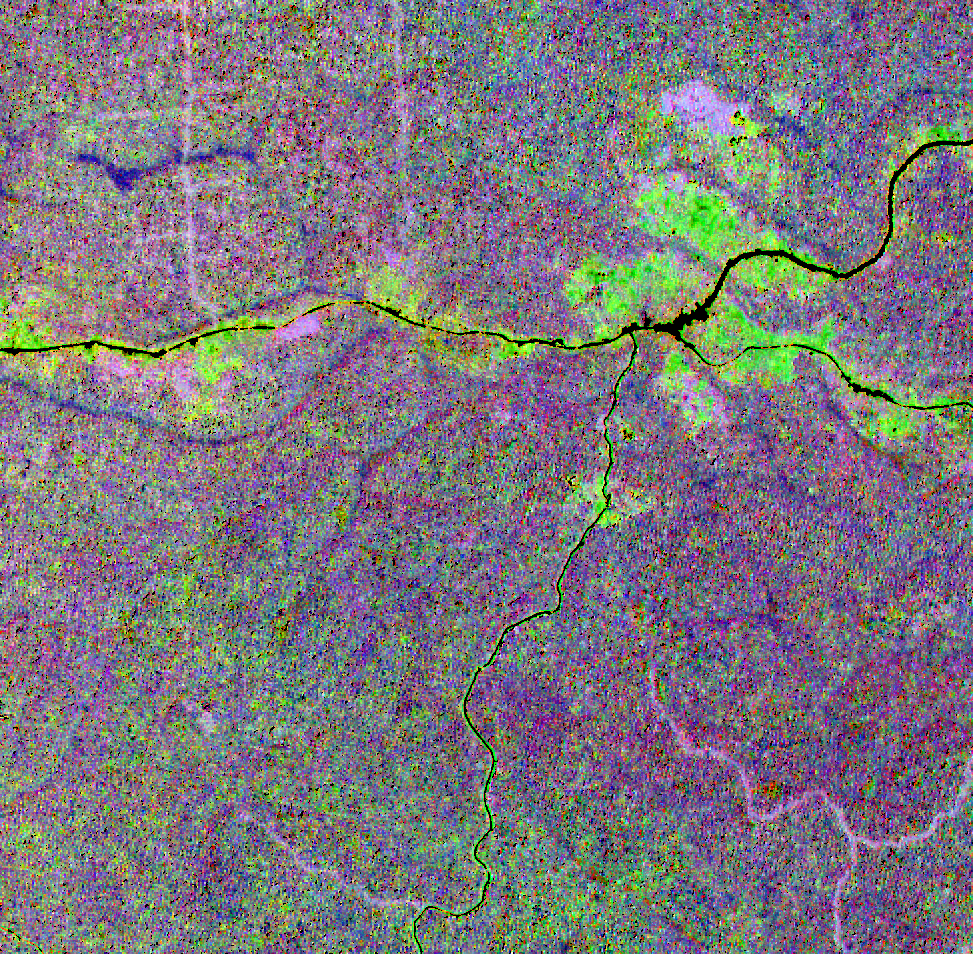

```{r setup, include = FALSE}
knitr::opts_chunk$set(
  collapse = TRUE,
  comment = "#>",
  eval=FALSE
)
options(rmarkdown.html_vignette.check_title = FALSE)
```

## Producing features from reflectance data: principle

A pre-processing step is usually required in order to produce relevant features from remote sensing data. When using multispectral/hyperspectral optical imagery, several alternatives can be considered to produce these features.

-   **Spectral transformation**. This includes PCA, MNF, as well as various multidimensional methods applying linear or non-linear transformations using the full spectral information

-   **Spectral indices**. They consist in applying simple transformations (difference, ratio, normalized difference...) on a limited number of spectral bands available from sensor acquisition. These include NDVI, EVI, NDWI1...

-   **Biophysical properties**. They involve physical information obtained from radiative transfer models, combined with an inversion algorithm dedicated to regression in order to link reflectance measured over part or all of the spectral range covered by a sensor, to one or multiple vegetation characteristics, such as LAI, leaf pigment and water content, LMA.

This tutorial describes a selection of options available for users interested in producing features from an optical sensor (here, Sentinel-2) to prepare for `biodivMapR.`

## Reflectance data and vegetation mask

The image is assumed to be downloaded from the procedure described [previously](https://jbferet.github.io/biodivMapR/articles/biodivMapR_01.html){target="_blank"}

The binary mask corresponding to the image to be processed is optional. However we strongly recommend using a mask when possible in order to discard pixels which may not be relevant for ecological analysis. This is the case for shaded, cloudy and non-vegetated pixels when focusing on vegetation biodiversity. Artificial surfaces and mineral surfaces should also be masked as they usually strongly contribute to spectral variability and do not inform about biological diversity.

```{r set path for image and mask}
# variables Refl_L2A and vegetation_mask defined in previous tutorial
input_raster_path <-  Refl_L2A
input_mask_path <-  vegetation_mask
```

## Spectral transformation

Standardized Principal Component Analysis (SPCA) can be applied on Sentinel-2 images with the code below.

First, the mask produced with `preprocS2` during the previous step is refined using a combination of radiometric filters.

-   **NDVI filtering**: allows filtering to eliminate non-vegetated pixels. Nothing fancy so you may need to deal with mixed pixels... `NDVI_Thresh` defines the minimum NDVI value to be kept. By default, the NDVI is computed based on the NIR spectral band closest to 835 nm, and the RED spectral band closest to 670 nm.

-   **NIR filtering**: allows filtering of shadows and pixels with very low signal. `NIR_Thresh` defines the minimum NIR value to be kept. By default, the NIR spectral band closest to 835 nm is used.

-   **BLUE filtering**: allows filtering of clouds, based on the hypothesis that atmospheric scattering will lead to higher reflectance in the blue domain. `Blue_Thresh` defines the maximum Blue reflectance to be kept. By default, the Blue spectral band closest to 480 nm is used.

Normalization of reflectance data with Continuum Removal can be performed as additional pre-processing step. This is done by setting `Continuum_Removal = T` as input when running `perform_PCA`.

**Continuum Removal** is available when working with reflectance data only. It requires information on the sensor spectral bands, defined by `input_rast_wl` This procedure eliminates multiplicative effects on reflectance. It proved to be relatively efficient in decreasing the effect of changes in illumination within individual tree crowns, when using high spatial resolution imaging spectroscopy over tropical forests.

**Continuum Removal** is recommended when processing high spatial resolution (spatial resolution $\leq$ 10 m) multi and hyperspectral data.

```{r compute SPCA}
library(biodivMapR)

output_dir <- './biodivMapR'
# 1- define spectral bands corresponding to the sensor. 
# central wavelength of S2 spectral bands can be loaded from biodivMapR data
HDRpath <- system.file('extdata', 'HDR', 'SENTINEL_2.hdr', package = 'biodivMapR')
SensorBands <- read_ENVI_header(HDRpath = HDRpath)$wavelength

# 2- define spectral transformation: select between 'PCA' and 'SPCA'
spectral_transformation <- 'SPCA'

# 3- define path for output directory
output_dir_PCA <- file.path(output_dir, spectral_transformation)

# 4- apply additional (very basic) radiometric filtering
# --> User's responsibility to check if resulting mask meets needs
NDVI_Thresh <- 0.65     # NDVI thresholding to exclude non vegetated pixels
Blue_Thresh <- 500      # Blue thresholding to exclude remaining cloudy/hazy pixels
NIR_Thresh <- 1500      # NDVI thresholding to exclude remaining shaded pixels
mask_path_PCA <- radiometric_filtering(input_raster_path = input_raster_path, 
                                       input_rast_wl = SensorBands, 
                                       input_mask_path = input_mask_path,
                                       output_dir = output_dir_PCA,
                                       NDVI_Thresh = NDVI_Thresh, 
                                       Blue_Thresh = Blue_Thresh, 
                                       NIR_Thresh = NIR_Thresh)

# 5- apply spectral transformation on continuum removed reflectance
PCA_Output <- perform_PCA(input_raster_path = input_raster_path, 
                          input_rast_wl = SensorBands, 
                          output_dir = output_dir_PCA, 
                          Continuum_Removal = Continuum_Removal, 
                          input_mask_path =  mask_path_PCA, 
                          maxRows = 1000)
```

The original publication [Féret & Asner (2014)](https://doi.org/10.1890/13-1824.1) used SPCA when applying the method implemented in `biodivMapR`. This procedure remains a valid option.

Once spectral transformation is performed, users are requested to select relevant components. `biodivMapR` currently does not provide automated procedure for principal component (PC) selection. Hence, PC selection is users' responsibility. We recommend selection based on visual inspection in order to identify spatial features highlighting changes in vegetation types / species composition. This procedure requires expertise on the ecosystem of interest. PC selection should ideally be validated with ground information.

Data-driven methods adjusted based on data distribution for a specific image/site, such as PCA, usually show poor generalization ability, and cannot be applied on other images. As explained earlier, PC selection is a subjective step which prevents from fully automated workflows. Moreover, spectral transformation such as PCA and MNF are usually computationally demanding.


Here, we selected components 1, 5, and 6 to produce the diversity maps. 
A color composition of these components is displayed below. 

<p>



</p>

Note that the selection of spectral indices used here may not be optimal.
Users may want to test various combinations of spectral indices. 
The function `biodivMapR_SFS` included in the package allows sequential feature selection to identify the set of features optimizing a criterion (diversity metrics, discrimination among vegetation types). 

Users can contact the authors of the package for assistance if needed when running  `biodivMapR_SFS`. 

## Spectral indices

Spectral indices can be considered as input spectral features in the perspective of application over large regions, or generalization in space and time of spectral diversity models produced with `biodivMapR.`

Here, we will illustrate how to produce spectral indices from Sentinel-2 reflectance with the R package [`spinR`](https://gitlab.com/jbferet/spinr)

```{r compute spectral indices}
library(spinR)

# 1- define spectral bands corresponding to the sensor. 
# central wavelength of S2 spectral bands can be loaded from biodivMapR data
HDRpath <- system.file('extdata', 'HDR', 'SENTINEL_2.hdr', package = 'biodivMapR')
SensorBands <- read_ENVI_header(HDRpath = HDRpath)$wavelength

# 2- define path for output directory and create it
spectral_transformation <- 'SpectralIndices'
output_dir_SI <- file.path(output_dir, spectral_transformation)
dir.create(output_dir, showWarnings = F, recursive = T)

# 3- [for information] list spectral indices included in spinR
spinR::listIndices_spinR()

# 4- define spectral indices of your choice
SI_list <- c('CCCI', 'LAI_SAVI', 'CR_SWIR')
# - CCCI is expected to be correlated to vegetation chlorophyll content
# - LAI_SAVI is expected to be correlated to Leaf Area Index
# - CR_SWIR is expected to be correlated to vegetation water content
SI_path <- spectralindices_from_raster(input_raster_path = input_raster_path, 
                                       input_rast_wl = SensorBands, 
                                       output_dir = output_dir_SI, 
                                       SI_list = SI_list, 
                                       input_mask_path =  input_mask_path)

# 6- update mask based on interquartile range.
# Inf or extreme values can be obtained from some spectral indices
# (e.g. negative reflectance or extremely low values used in ratio)
# this optional step ensures that erroneous vegetation indices are discarded. 
mask_path_SI <- file.path(output_dir_SI, 'Mask_update_IQR.tif')
compute_mask_IQR(input_raster_path = SI_path,
                 output_mask_path = mask_path_SI,
                 input_mask_path = input_mask_path)
```

Spectral indices (SI) are computationally less demanding than spectral transformation.

They are theoretically more generalizable through space and time than spectral features resulting from PCA. However, SI are also sensitive to the conditions of acquisition and properties extrinsic to vegetation. such as :

-   geometry of acquisition (relative sun/satellite position
-   atmospheric properties and associated correction for L2A reflectance production
-   soil properties in case of low density vegetation
-   sensor characteristics

SI to be used with `biodivMapR` should be selected so that they can be related to vegetation properties. SI showing artifacts caused by sensor or factors extrinsic to vegetation should be avoided.


Note that the selection of spectral indices used here may not be optimal.
Users may want to test various combinations of spectral indices. 
The function `biodivMapR_SFS` included in the package allows sequential feature selection to identify the set of features optimizing a criterion (diversity metrics, discrimination among vegetation types). 

Users can contact the authors of the package for assistance if needed when running  `biodivMapR_SFS`. 

A color composition of the three spectral indices selected is displayed below: 

<p>


</p>


## Biophysical properties

Biophysical properties obtained from physical model inversion are an alternative to data-driven spectral transformation and spectral indices.

Vegetation biophysical properties can be obtained with the package [`prosail`](https://jbferet.gitlab.io/prosail). An example of computation of vegetation biophysical properties from PROSAIL hybrid inversion applied to Sentinel-2 imagery is described [here](https://jbferet.gitlab.io/prosail/articles/prosail4.html).

Vegetation biophysical properties are theoretically the best option recommended for the application of `biodivMapR`. They produce information directly related to vegetation properties, such as leaf pigment content, water content, Leaf Mass per Area (LMA), Leaf Area Index (LAI). They are able to account for factors such as geometry of acquisition, soil properties, sensor characteristics.

However, these procedures for biophysical properties estimation also show limitations:

-   Physical model inversion are computationally more demanding than SI. Model inversion requires simulation of a training set, machine learning training and application to the image data.

-   Model inversion may require fine tuning of the training set in order to get optimal estimation of vegetation biophysical properties. Generic parameterization may lead to suboptimal estimations, with possible saturation.

## Choosing the right spectral features

As describe above, several procedures can be applied in order to produce features which will feed `biodivMapR`.

The authors of this package currently do not have firm recommendations. Users should test, explore and compare resulting spectral diversity metrics to ecological information obtained from ground observations.

We consider spectral indices as a good trade-off when using Sentinel-2 data, given the straightforward computation and the possibility to relate these spectral indices to specific spectral domains and to vegetation properties, or groups of vegetation properties.

Spectral transformation produce original features taking advantage of rich spectral information. They are more suitable to summarize information from imaging spectroscopy:\
MNF for example, should produce latent features with minimum colinearity, and contribute to separate information on vegetation from noisy signal.

Please contact the authors of this package if in need for additional information.

<br/><br/>

Once spectral features are computed, `biodivMapR` can be applied. This is described in this [tutorial](https://jbferet.github.io/biodivMapR/articles/biodivMapR_03.html){target="_blank"}.
