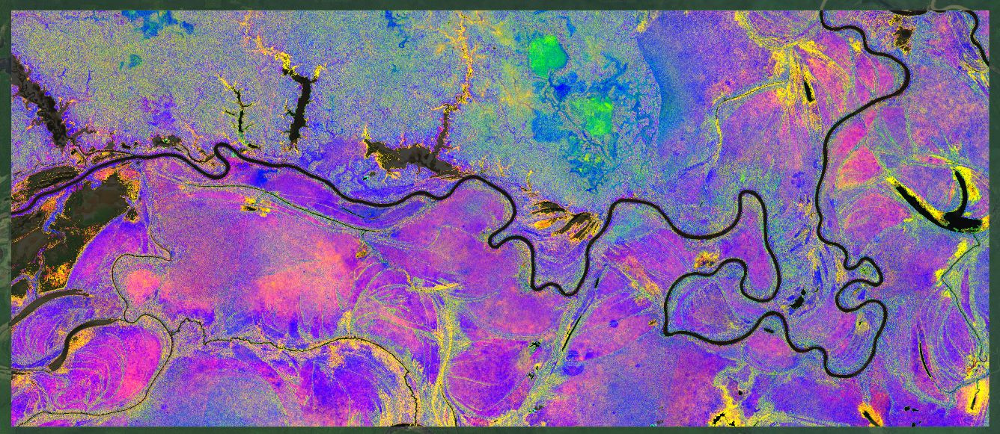

```{r setup, include = FALSE}
knitr::opts_chunk$set(
  collapse = TRUE,
  comment = "#>",
  eval=FALSE
)
options(rmarkdown.html_vignette.check_title = FALSE)
```

## producing spectral features from reflectance data: principle

A pre-processing step is usually required in order to produce relevant features 
from remote sensing data. 
When using multispectral/hyperspectral optical imagery, several alternatives can 
be considered to produce these features.

-   **Spectral transformation**. This includes principal component analysis, 
minimum noise fraction, or any multidimensional method applying linear or 
non-linear transformations using the spectral information

-   **Spectral indices**. They consist in applying simple transformations 
(difference, ratio, normalized difference...) on a limited number of spectral 
bands available from sensor acquisition. 

-   **Biophysical properties**. They involve physical information obtained from 
radiative transfer models, combined with an inversion algorithm dedicated to 
regression. 
They aim at linking reflectance measured over part or all of the spectral 
range covered by a sensor, to one or multiple vegetation characteristics, such 
as LAI, leaf pigment and water content, LMA.

This tutorial describes a selection of options available for users interested in 
producing features from Sentinel-2 data to prepare for `biodivMapR` analysis. 

## reflectance data and vegetation mask

The image is assumed to be downloaded from the procedure described [previously](https://jbferet.github.io/biodivMapR/articles/biodivMapR_01.html){target="_blank"}

The binary mask corresponding to the image to be processed is optional. 
However we strongly recommend using a mask when possible in order to discard 
pixels which may not be relevant for ecological analysis. 
This is the case for shaded, cloudy and non-vegetated pixels when focusing on 
vegetation biodiversity. 
Artificial surfaces and mineral surfaces should also be masked as they usually 
strongly contribute to spectral variability and do not inform about biological 
diversity.

__Insufficient masking of irrelevant pixels may lead to poor estimation of vegetation diversity__: 
interfaces between vegetation non-vegetated regions (soil, artificial surface, 
water) will show very high local spectral heterogeneity.  
This will most probably lead to high spectral diversity, unrelated to species 
diversity. 

## spectral transformation

Standardized Principal Component Analysis (SPCA) can be applied on Sentinel-2 
images with the code below.

First, the mask produced with `preprocS2` during the previous step is refined 
using a combination of radiometric filters.

-   **NDVI filtering**: allows filtering to eliminate non-vegetated pixels. 
Nothing fancy so you may need to deal with mixed pixels. 
`NDVI_Thresh` defines the minimum NDVI value to be kept. 
By default, the NDVI is computed based on the NIR spectral band closest to 835 nm, 
and the RED spectral band closest to 670 nm.

-   **NIR filtering**: allows filtering of shadows and pixels with very low signal. 
`NIR_Thresh` defines the minimum NIR value to be kept. 
By default, the NIR spectral band closest to 835 nm is used.

-   **BLUE filtering**: allows filtering of clouds, based on the hypothesis that 
atmospheric scattering will lead to higher reflectance in the blue domain. 
`Blue_Thresh` defines the maximum Blue reflectance to be kept. 
By default, the Blue spectral band closest to 480 nm is used.

Normalization of reflectance data with Continuum Removal can be performed as 
additional pre-processing step. 
This is done by setting `Continuum_Removal = T` as input for `perform_PCA`.

**Continuum Removal** is available when working with reflectance data only. 
It requires information on the sensor spectral bands, defined by `input_rast_wl`. 
This procedure eliminates multiplicative effects on reflectance. 
It proved to be relatively efficient in decreasing the effect of changes in 
illumination within individual tree crowns, when using high spatial resolution
imaging spectroscopy over tropical forests.

Continuum Removal is recommended when processing high spatial resolution 
(spatial resolution $\leq$ 10 m) multi and hyperspectral data.

```{r compute SPCA}
library(biodivMapR)
output_dir <- './03_RESULTS/amazon'
dir.create(path = output_dir, showWarnings = F, recursive = T)
# 1- define spectral bands corresponding to the sensor. 
# central wavelength of S2 spectral bands can be loaded from biodivMapR data
hdr_path <- system.file('extdata', 'HDR', 'SENTINEL_2.hdr', 
                        package = 'biodivMapR')
sensor_bands <- read_envi_header(HDRpath = hdr_path)$wavelength

# 2- define spectral transformation: select between 'PCA' and 'SPCA'
spectral_transformation <- 'SPCA'

# 3- define path for output directory
output_dir_PCA <- file.path(output_dir, spectral_transformation)

# 4- apply additional (very basic) radiometric filtering
# --> User's responsibility to check if resulting mask meets needs
NDVI_Thresh <- 0.65     # NDVI thresholding to exclude non vegetated pixels
Blue_Thresh <- 500      # Blue thresholding to exclude remaining cloudy/hazy pixels
NIR_Thresh <- 1500      # NDVI thresholding to exclude remaining shaded pixels
mask_path_PCA <- radiometric_filtering(input_raster_path = rast_path, 
                                       input_rast_wl = sensor_bands, 
                                       input_mask_path = mask_path,
                                       output_dir = output_dir_PCA,
                                       NDVI_Thresh = NDVI_Thresh, 
                                       Blue_Thresh = Blue_Thresh, 
                                       NIR_Thresh = NIR_Thresh)

# 5- apply spectral transformation on continuum removed reflectance
PCA_Output <- perform_PCA(input_raster_path = rast_path, 
                          input_rast_wl = sensor_bands, 
                          output_dir = output_dir_PCA, 
                          Continuum_Removal = T, 
                          input_mask_path =  mask_path_PCA, 
                          maxRows = 1000)
```

Once spectral transformation is performed, principal component (PC) selection 
needs to be done. 
`biodivMapR` currently does not provide automated procedure for PC selection. 
Hence, PC selection is users' responsibility. 
We recommend selection based on visual inspection in order to identify spatial 
features highlighting changes in vegetation types / species composition. 
This procedure requires expertise on the ecosystem of interest. 
PC selection should ideally be validated with ground information.

Data-driven methods adjusted based on data distribution for a specific 
image/site, such as PCA, usually show poor generalization ability, and cannot be 
applied on other images. 
As explained earlier, PC selection is a subjective step which prevents from 
fully automated workflows. Moreover, spectral transformation such as PCA and MNF 
are usually computationally demanding.

Here, we selected components 1, 4, 5 and 6 to produce the diversity maps. 
A color composition of components 1, 4 and 5 is displayed below. 

<p>

</p>
<center>
  Fig. 1. color composition of pricnipal components computed from sentinel-2
  acquisition. R = PC#1, G = PC#4, B = PC#5. 
</center> 
<p>&nbsp;</p>

Note that the selection of spectral indices used here may not be optimal.
Users may want to test various combinations of spectral indices. 
The function `biodivMapR_sfs` included in the package allows sequential feature 
selection to identify the set of features optimizing a criterion (diversity 
metrics, discrimination among vegetation types). 

Users can contact the authors of the package for assistance if needed when 
running  `biodivMapR_sfs`.

## spectral indices

Several packages exist for the computation of spectral indices. 

The package [awesome spectral indices](https://awesome-ee-spectral-indices.readthedocs.io/en/latest/)
provides exhaustive tools for the computation of spectral indices. 

[`spinR`](https://gitlab.com/jbferet/spinr) provides basic functionalities to 
compute directly popular spectral indices from raster data or matrices. 


### introduction to `spinR`

The spectral indices implemented in `spinR` are designed to be applied on 
Sentinel-2 data.
The list of spectral indices and corresponding S2 spectral bands can be obtained 
as follows

```{r list si}
spinR::listIndices_spinR()
```

### computing spectral indices from Sentinel-2 raster

In the perspective of producing biodiversity maps with biodivMapR, 
the original surface reflectance raster is be divided into tiles, which will be 
processed individually to compute spectral indices.
This workflows eases parallel processing for the next steps of the tutorial.

#### defining a processing grid

The size of the tiles needs to be defined with the variable `cellsize` (meters).
the function `get_grid_aoi` produces a grid based on the aoi and on cellsize. 

```{r define grid}
# define cell size of 4000 m
cellsize <- 4000 

# define tiling grid over AOI
rast_obj <- terra::rast(rast_path)
mask_obj <- terra::rast(mask_path)
crs_target <- terra::crs(x = rast_obj)
path_grid <- get_grid_aoi(aoi_path = aoi_path,
                          cellsize = cellsize,
                          output_dir = output_dir,
                          crs_target = crs_target)

crs_target <- path_grid$crs_target
plots <- path_grid$plot
nb_plots <- length(plots)
dsn_grid <- path_grid$dsn_grid
```

The grid is stored as a geopackage file (.gpkg) named `aoi_grid_4000.gpkg` in 
`output_dir` and can be opened with QGIS.
A total of 84 tiles are defined over the aoi.

<p>

</p>
<center>
  Fig. 2. grid defined to compute spectral indices over sentinel-2 acquisition
</center> 
<p>&nbsp;</p>

#### computing spectral indices from the gridded S2 acquisition

Spectral indices can then be computed for each of the 84 cells of the grid with 
the function `compute_si_from_grid`.

Here, we define three spectral indices: 
- `NDVI`: normalized difference vegetation index, sensitive to vegetation 
density and health. 
NDVI is influenced by vegetation chlorophyll content and leaf area index (LAI). 

$$NDVI = \frac{R_\text{B08} - R_\text{B04}}{R_\text{B08} + R_\text{B04}}$$

- `CR_SWIR`: continuum removal in the shortwave infrared (SWIR). 
The CR_SWIR is sensitive to vegetation water content.

$$CR_\text{SWIR} = \frac{R_\text{B11}}{R_\text{B8A}+(\lambda_\text{B11}-\lambda_\text{B8A}) * \frac{R_\text{B12}-R_\text{B8A}}{\lambda_\text{B12}-\lambda_\text{B8A}}}$$

- `LAI_SAVI` Soil adjusted vegetation index for LAI. Sensitive to LAI. 

$$LAI_\text{SAVI} = \frac{-log(0.371+1.5*\frac{R_\text{B08}-R_\text{B04}}{R_\text{B08}+R_\text{B04}+0.5})}{2.4}$$

```{r compute si}
# compute spectral indices
si_list <- c('NDVI', 'CR_SWIR', 'LAI_SAVI')
output_si <- compute_si_from_grid(rast_path = rast_path, 
                                  mask_path = mask_path, 
                                  plots = plots, overwrite = F, 
                                  sensor_name = 'sentinel-2',
                                  site_name = site_name, 
                                  si_list = si_list, 
                                  output_dir = output_dir, 
                                  ReflFactor = 10000)

output_dir_si <- dirname(output_si[[1]][[1]])
```

The spectral indices corresponding to individual tiles are then saved in the 
`output_dir_si` directory. 

#### visualizing spectral indices

A virtual raster (.vrt) is automatically produced for each spectral index and 
saved in the directory `./03_RESULTS/amazon/sentinel-2/spectral_indices_vrt`.

<p>

</p>
<center>
  Fig. 3. color composition of spectral indices computed from sentinel-2 
  acquistion. R = `LAI_SAVI`, G = `NDVI`, B = `CR_SWIR`
</center> 
<p>&nbsp;</p>


Spectral indices are computationally less demanding than spectral transformation.
They are theoretically more generalizable through space and time than spectral 
features resulting from PCA. 
However, they are also sensitive to the conditions of acquisition and properties 
extrinsic to vegetation. such as :

-   geometry of acquisition (relative sun/satellite position
-   atmospheric properties and associated correction for L2A reflectance production
-   soil properties in case of low density vegetation
-   sensor characteristics

Spectral indices should be selected so that they can be related to vegetation 
properties. 
Spectral indices showing artifacts caused by sensor or factors extrinsic to 
vegetation should be avoided.

Note that the spectral indices used here may not be optimal.
Users may want to test various combinations of spectral indices.
The function `biodivMapR_SFS` included in the package allows sequential feature
selection to identify the set of features optimizing a criterion (diversity 
metrics, discrimination among vegetation types). 
Users can contact the authors of the package for assistance if needed when 
running `biodivMapR_SFS`.


## biophysical properties

Biophysical properties obtained from physical model inversion are an alternative 
to data-driven spectral transformation and spectral indices.

Vegetation biophysical properties can be obtained with the package 
[`prosail`](https://jbferet.gitlab.io/prosail). 
An example of computation of vegetation biophysical properties from PROSAIL 
hybrid inversion applied to Sentinel-2 imagery is described 
[here](https://jbferet.gitlab.io/prosail/articles/prosail4.html).

Vegetation biophysical properties are theoretically the best option recommended 
for the application of `biodivMapR`. 
They produce information directly related to vegetation properties, such as 
leaf pigment content, water content, Leaf Mass per Area (LMA), LAI.
They are able to account for factors such as geometry of acquisition, soil 
properties, sensor characteristics.

However, these procedures for biophysical properties estimation also show 
limitations:

-   Physical model inversion are computationally more demanding than SI. 
Model inversion requires simulation of a training set, machine learning training 
and application to the image data.

-   Model inversion may require fine tuning of the training set in order to get 
optimal estimation of vegetation biophysical properties. Generic 
parameterization may lead to suboptimal estimations, with possible saturation.


## selecting the right spectral features

As describe above, several procedures can be considered to produce features 
then used with `biodivMapR`.

**The authors of this package currently do not have firm recommendations**. 
Users should test, explore and compare resulting spectral diversity metrics to 
ecological information obtained from ground observations.

We consider spectral indices as an acceptable trade-off when using Sentinel-2 
data, given the straightforward computation and the possibility to relate these 
spectral indices to specific spectral domains and to vegetation properties, or 
groups of vegetation properties.

Spectral transformation produce original features taking advantage of rich 
spectral information. 
They are more suitable to summarize information from imaging spectroscopy:
MNF for example, should produce latent features with minimum colinearity, 
and contribute to separate information on vegetation from noisy signal.

Please contact the authors of this package if in need for additional information.

<br/><br/>

Once spectral features are computed, `biodivMapR` can be applied. 
This is described in this [tutorial](https://jbferet.github.io/biodivMapR/articles/biodivMapR_03.html){target="_blank"}.
