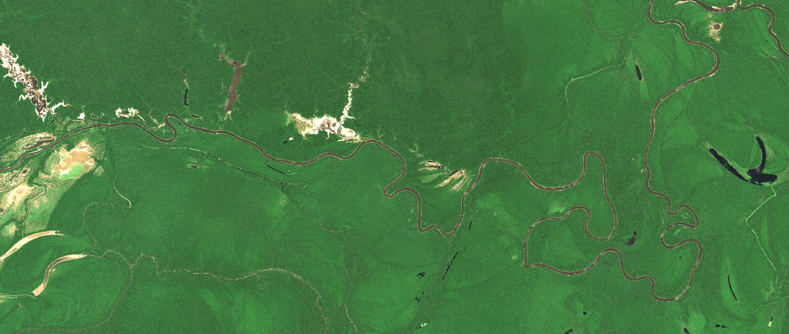

```{r setup, include = FALSE}
knitr::opts_chunk$set(
  collapse = TRUE,
  comment = "#>",
  eval=FALSE
)
options(rmarkdown.html_vignette.check_title = FALSE)
```

Once spectral features are computed from optical data, they can be used as 
input variables in `biodivMapR`.

Starting from `biodivMapR v2`, a simplified procedure is followed compared to 
`biodivMapR v1`. 
A unique function named `biodivMapR_full` runs the full workflow and produces a 
limited set of outputs.

## produce diversity maps from SPCA file

SPCA was previously computed and the relevant spectral features were identified 
based on visual interpretation. 
These selected components are used to produce diversity maps with `biodivMapR`. 
The SPCA file is a unique raster file stacking all components. 
`biodivMapR` requires 
- the path for the input raster: it can be a unique stacked raster, or a set of 
individual features.
The current version does not accept combination of stacked raster and individual 
raster layers as input. 

- optionally, if `biodivMapR` is expected to run on a selection of features from 
the input raster, these can be specified with the variable `selected_bands`.

- here, we also take advantage of the mask previously computed.

```{r run biodivMapR with slected components from SPCA file}

# 1- define biodivMapR output directory 
output_dir_biodivMapR <- file.path(output_dir, 'biodivMapR/SPCA')
dir.create(output_dir_biodivMapR, showWarnings = F, recursive = T)

# 2- define parameters for biodivMapR
window_size <- 10     # window side size for computation of spectral diversity
nb_clusters <- 50     # nb of clusters (spectral species)

# 3- define path for intermediate variables to be saved
# - information related to kmeans clustering defining spectral species
Kmeans_info_save <- file.path(output_dir_biodivMapR,'Kmeans_info.RData')
# - information related to beta diversity mapping (BC dissimilarity + PCoA)
Beta_info_save <- file.path(output_dir_biodivMapR,'Beta_info.RData')

# 4- adjust parameters for multithread & computational efficiency
nbCPU <- 4            # nb of threads for parallel processing
# 5- apply biodivMapR 
selected_bands <- c(1, 4, 5, 6)
options <- set_options_biodivMapR(fun = 'biodivMapR_full')
options$nb_clusters <- nb_clusters
options$maxRows <- 1000
ab_info_SPCA <- biodivMapR_full(input_raster_path = PCA_Output$PCA_Files$PCA, 
                                input_mask_path = mask_path_PCA,
                                output_dir = output_dir_biodivMapR, 
                                selected_bands = selected_bands, 
                                window_size = window_size, 
                                Kmeans_info_save = Kmeans_info_save,
                                Beta_info_save = Beta_info_save, 
                                nbCPU = nbCPU, options = options)
```

`ab_info_SPCA` produced from the `biodivMapR_full` function includes two lists:

-   `Kmeans_info`, which gathers all information related to the k-means 
clustering: centroid, min and max values for each feature

-   `Beta_info`, which gathers all information related to the computation of the 
beta diversity

These lists are saved as `Rdata` files corresponding to the files defined by 
`Kmeans_info_save` and `Beta_info_save`. 
These files can then be used for an independent process with `biodivMapR_full`. 
The path for these files can then be provided for input variables 
`Kmeans_info_read` and `Beta_info_read`.

`biodivMapR` will not recompute this information, if user provides a valid path 
for `Kmeans_info` and `Beta_info`. 
This option is interesting when adjusting `Kmeans_info` and `Beta_info` for a 
region including multiple tiles, and processing each tile independently.

$\alpha$ and $\beta$ diversity maps produced from the analysis of selected PCs 
are displayed below.


<p>

</p>
<p>

</p>
<center>
  Fig. 1. maps of shannon index and beta-diversity obtained from biodivMapR 
  analysis on selected components computed from sentinel-2 acquisition.
</center> 
<p>&nbsp;</p>


## Produce diversity maps from spectral indices with `biodivMapR`

Spectral indices computed previously will be used here to produce diversity maps 
with `biodivMapR`. 
Each spectral index was saved following a tiling system, and a vrt was produced. 
`biodivMapR` can use the path for the vrt as `input_raster_path` for 
`biodivMapR_full`. 
Alternatively, it can take advantage of the tiling system in order to process 
the image tile per tile in parallel. 

```{r run biodivMapR with spectral indices}

# 1- define biodivMapR output directory 
output_dir_biodivMapR_si <- file.path(output_dir, 'biodivMapR/spectral_indices')
output_dir_mask <- file.path(output_dir, 'biodivMapR/spectral_indices_mask')
dir.create(output_dir_biodivMapR_si, showWarnings = F, recursive = T)
dir.create(output_dir_mask, showWarnings = F, recursive = T)

# 3- define path for intermediate variables to be saved
# - information related to kmeans clustering defining spectral species
Kmeans_info_save <- file.path(output_dir_biodivMapR_si,'Kmeans_info.RData')
# - information related to beta diversity mapping (BC dissimilarity + PCoA)
Beta_info_save <- file.path(output_dir_biodivMapR_si,'Beta_info.RData')

# 4- apply biodivMapR 
options <- set_options_biodivMapR(fun = 'biodivMapR_full_tiles')
options$nb_clusters <- nb_clusters
options$alpha_metrics <- c('richness', 'shannon', 'hill')

ab_info_SI <- biodivMapR_full_tiles(feature_dir = output_dir_si, 
                                    list_features = si_list, 
                                    output_dir = output_dir_biodivMapR_si, 
                                    mask_dir = output_dir_mask, 
                                    window_size = window_size, 
                                    plots = plots, nbCPU = nbCPU, 
                                    site_name = site_name, options = options)
```

<p>

</p>
<p>

</p>
</p>
<center>
  Fig. 2. maps of $\alpha$-diversity (shannon' H) and $\beta$-diversity obtained 
  from `biodivMapR` analysis on spectral indices from sentinel-2 acquisition.
</center> 
<p>&nbsp;</p>


<br/><br/>

The validation can then be performed if ground information is available Validation is described in this [tutorial](https://jbferet.github.io/biodivMapR/articles/biodivMapR_04.html){target="_blank"}.
