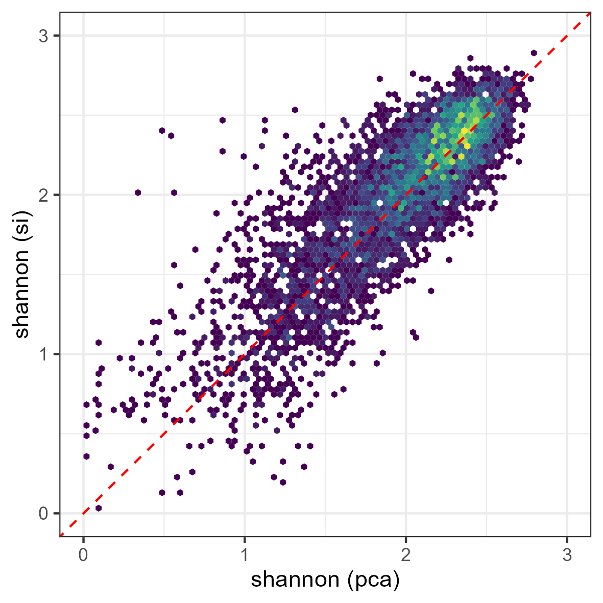
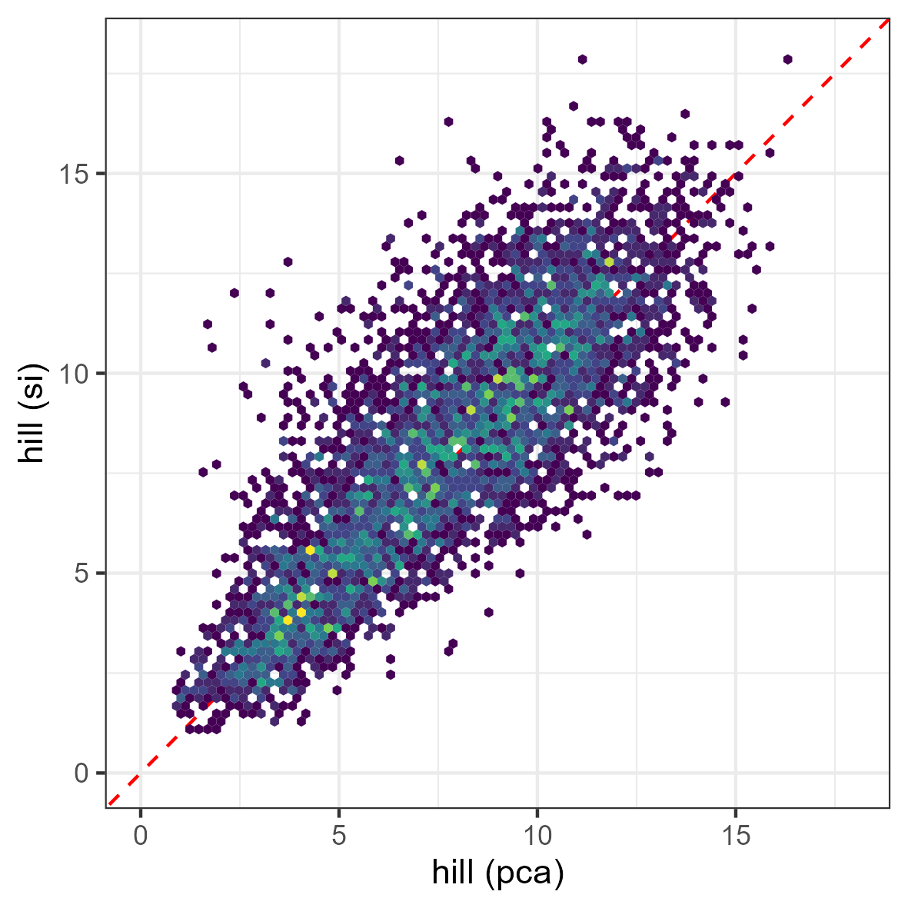

```{r setup, include = FALSE}
knitr::opts_chunk$set(
  collapse = TRUE,
  comment = "#>",
  eval=FALSE
)
options(rmarkdown.html_vignette.check_title = FALSE)
```

This tutorial illustrates how to perform validation of spectral diversity 
metrics based on ground information.
Ground information should be associated with a vector layer including polygons.
The size of the polygons should be compatible with ground information and with 
remote sensing information.

**biodivMapR does not aim at producing diversity metrics with absolute accuracy**:\
the spectral diversity metrics produced with `biodivMapR` are not expected to 
match the absolute value of diversity metrics. 
Hence, when performing validation of diversity metrics with ground observations, 
users should favor correlation analyses, rather than using metrics such as 
RMSE between biodiversity indices measured from inventories and diversity 
metrics produced with`biodivMapR` . 

The choice of the number of clusters is directly influencing the range of the 
spectral $\alpha$ diversity metrics: higher number of clusters lead to higher 
maximum potential values of spectral richness, Shannon index and Hill index.


The function `biodivMapR_opt_clusters` can be used to identify the number of 
clusters maximizing the correlation between spectral diversity metrics and 
observations. 


**Ground information should not correspond to individual points**:\
`biodivMapR` produces diversity metrics based on information extracted from a 
group of pixels.
$\alpha$ and $\beta$ spectral diversity metrics are computed from the 
distribution of cluster populations is each polygon.
Therefore we recommend that each polygon defining an validation plots should 
correspond to **at least 25-50 pixels of the image**.

This code computes $\alpha$ and $\beta$ spectral diversity metrics over the 
footprint defined by polygons of a vector layer.

### Validation of `biodivMapR` using spectral features obtained from SPCA

The function `get_diversity_from_plots` can be performed using the `biodivMapR` 
spectral diversity models adjusted previously and saved in the 
`Kmeans_info.RData` and `Beta_info.RData` variables.
The following code illustrates how to proceed, based on results obtained from 
previous tutorials.
As we do not have ground information available for these sites, we will compare 
spectral diversity metrics obtained with the two sets of spectral features: 
selected components from a PCA, and a selection of spectral indices. 

First, we randomly distribute square polygons with a surface matching with 
`window_size`.

```{r define samples}
# get extent of area of interest
input_rast <- terra::rast(rast_path)
extent_area <- get_raster_extent(input_rast = input_rast)
# sample data
samples <- sf::st_sample(x = sf::st_as_sf(extent_area), size = 5000,
                         force = TRUE)
# get resolution and adjust window around samples
raster_res <- terra::res(input_rast)
# apply buffer
bufferSize <- raster_res*window_size/2
samples <- terra::buffer(x = terra::vect(samples), width = bufferSize,
                         quadsegs = 8, capstyle  = 'square')
```

Then, spectral diversity is computed for these polygons based on the diversity 
mapped from PCA results.

```{r spectral diversity indices from vector layer and SPCA}
# get spectral diversity from plots distributed over SPCA data
input_rast_pca <- terra::rast(PCA_Output$PCA_Files$PCA)
diversity_pca <- get_diversity_from_plots(input_rast = input_rast_pca, 
                                          validation_vect = samples, 
                                          input_mask = terra::rast(mask_path_PCA), 
                                          Kmeans_info = ab_info_SPCA$Kmeans_info, 
                                          Beta_info = ab_info_SPCA$Beta_info, 
                                          selected_bands = selected_bands, 
                                          alpha_metrics = c('richness', 'shannon', 'hill', 'simpson'), 
                                          Hill_order = 1)
```

Next, spectral diversity is computed for these polygons based on the diversity 
mapped from spectral indices.


```{r spectral diversity indices from vector layer and si}
# get spectral diversity from plots distributed over spectral index data
input_rast_si <- list('NDVI' = terra::rast(file.path(output_dir, 'spectral_indices_vrt/amazon_001_2024-08-23_NDVI.vrt')), 
                      'CR_SWIR' = terra::rast(file.path(output_dir, 'spectral_indices_vrt/amazon_001_2024-08-23_CR_SWIR.vrt')), 
                      'LAI_SAVI' = terra::rast(file.path(output_dir, 'spectral_indices_vrt/amazon_001_2024-08-23_LAI_SAVI.vrt')))
diversity_si <- get_diversity_from_plots(input_rast = input_rast_si, 
                                          validation_vect = samples, 
                                          input_mask = terra::rast(mask_path_PCA), 
                                          Kmeans_info = ab_info_SI$Kmeans_info, 
                                          Beta_info = ab_info_SI$Beta_info, 
                                          selected_bands = si_list, 
                                          alpha_metrics = c('richness', 'shannon', 'hill', 'simpson'), 
                                          Hill_order = 1)

```


### Validation `biodivMapR` using spectral indices

The validation can also be performed using the `biodivMapR` spectral diversity 
models adjusted on spectral indices.
The following code illustrates how to proceed, based on results obtained from 
previous tutorials.

```{r spectral diversity indices from vector layer and spectral indices}
library(ggplot2)
library(RColorBrewer)
library(gridExtra)

# 1- list vector files corresponding to groups of validation plots
listShp <- as.list(list.files(path = output_dir_val, 
                              pattern = '.shp', full.names = T))

# 2- A SpatVectorCollection is created as validation plots correspond to multiple files
samplesVal <- lapply(listShp, terra::vect)
validation_vect <- terra::svc(samplesVal)

# 3- define SpatRaster for the set of spectral indices and corresponding mask
SI_rast <- lapply(SI_path,terra::rast)
mask_rast <- terra::rast(mask_path_SI)

# 4- perform validation over the footprint of each polygon
validation <- get_diversity_from_plots(input_rast = SI_rast,
                                       validation_vect = validation_vect,
                                       input_mask = mask_rast,
                                       Kmeans_info = ab_info_SI$Kmeans_info,
                                       Beta_info = ab_info_SI$Beta_info)

# 5- produce scatterplot using PCoA computed only from plots
filename <- file.path(output_dir_SI2,'BetaDiversity_Plots.png')
scatter_alphabeta(alpha = validation$specdiv$shannon_mean, 
                  PCoA_1 = validation$specdiv$BetaPlots_PCoA_1, 
                  PCoA_2 = validation$specdiv$BetaPlots_PCoA_2, 
                  PCoA_3 = validation$specdiv$BetaPlots_PCoA_3,
                  classes = validation$specdiv$source, 
                  filename = filename)

# produce scatterplot using PCoA computed from elements sampled across the full image
filename <- file.path(output_dir_SI2,'BetaDiversity_Full.png')
scatter_alphabeta(alpha = validation$specdiv$shannon_mean, 
                  PCoA_1 = validation$specdiv$BetaFull_PCoA_1, 
                  PCoA_2 = validation$specdiv$BetaFull_PCoA_2, 
                  PCoA_3 = validation$specdiv$BetaFull_PCoA_3,
                  classes = validation$specdiv$source, 
                  filename = filename)
```


The figures below illustrates the consistency in $\alpha$ and $\beta$ diversity 
metrics produced with `biodivMapR` over the same site with two different inputs 
(components selected from SPCA and spectral indices). 


```{r, eval=TRUE, echo = FALSE, out.width="100%"}
url <- "https://gitlab.com/jbferet/myshareddata/-/raw/master/biodivMapR_vignette_illustrations/04_intercomparison_pca_si.png"
knitr::include_graphics(url)
```

<!-- <p float="left"> -->
<!--    -->
<!--    -->
<!--    -->
<!-- </p> -->
<center>
  Fig. 1. comparison of `shannon`, `hill` and `bray curtis` obtained from the 
  two diversity maps obtained from SPCA and spectral indices.
</center> 
<p>&nbsp;</p>
