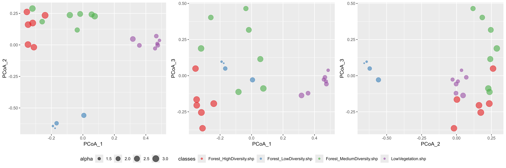
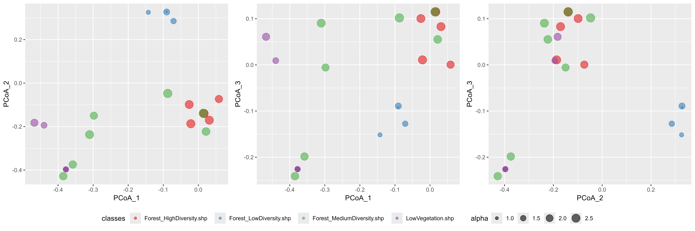
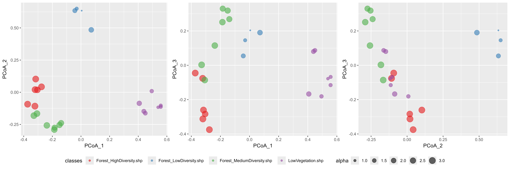
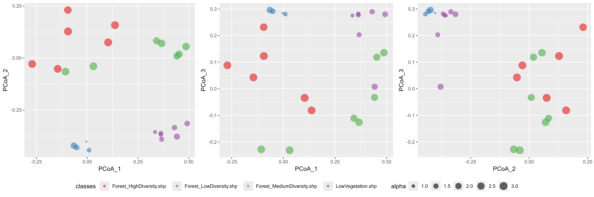

```{r setup, include = FALSE}
knitr::opts_chunk$set(
  collapse = TRUE,
  comment = "#>",
  eval=FALSE
)
options(rmarkdown.html_vignette.check_title = FALSE)
```

This tutorial illustrates how to perform validation of spectral diversity metrics based on ground information.
Ground information should be associated with a vector layer including polygons.
The size of the polygons is important, as it should be compatible with ground information.

**Ground information should not correspond to individual points**:\
`biodivMapR` produces diversity metrics based on information extracted from a group of pixels.
$\alpha$ and $\beta$ spectral diversity metrics are computed from the distribution of cluster populations is each polygon.
Therefore we recommend that each polygon defining an validation plots should correspond to at least 25-50 pixels of the image.

This code computes $\alpha$ and $\beta$ spectral diversity metrics over the footprint defined by polygons of a vector layer.

### Validation of `biodivMapR` using spectral features obtained from SPCA

The validation can be performed using the `biodivMapR` spectral diversity models adjusted on SPCA.
The following code illustrates how to proceed, based on results obtained from previous tutorials.

```{r spectral diversity indices from vector layer and SPCA}
library(ggplot2)
library(RColorBrewer)
library(gridExtra)

# 1- list vector files corresponding to groups of validation plots
listShp <- as.list(list.files(path = output_dir_val, 
                              pattern = '.shp', full.names = T))

# 2- A SpatVectorCollection is created as validation plots correspond to multiple files
samplesVal <- lapply(listShp, terra::vect)
validation_vect <- terra::svc(samplesVal)

# 3- define SpatRaster for the SPCA raster stack and corresponding mask
SPCA_rast <- terra::rast(PCA_Output$PCA_Files$PCA)
mask_rast <- terra::rast(mask_path_PCA)

# 4- perform validation over the footprint of each polygon
validation <- get_diversity_from_plots(input_rast = SPCA_rast,
                                       SelectBands = selectedPC, 
                                       input_mask = mask_rast,
                                       validation_vect = validation_vect,
                                       Kmeans_info = ab_info_SPCA$Kmeans_info,
                                       Beta_info = ab_info_SPCA$Beta_info)

# 5- produce scatterplot using PCoA computed only from plots
filename <- file.path(output_dir_PCA2,'BetaDiversity_Plots.png')
scatter_alphabeta(alpha = validation$specdiv$shannon_mean, 
                  PCoA_1 = validation$specdiv$BetaPlots_PCoA_1, 
                  PCoA_2 = validation$specdiv$BetaPlots_PCoA_2, 
                  PCoA_3 = validation$specdiv$BetaPlots_PCoA_3,
                  classes = validation$specdiv$source, 
                  filename = filename)

# produce scatterplot using PCoA computed from elements sampled across the full image
filename <- file.path(output_dir_PCA2,'BetaDiversity_Full.png')
scatter_alphabeta(alpha = validation$specdiv$shannon_mean, 
                  PCoA_1 = validation$specdiv$BetaFull_PCoA_1, 
                  PCoA_2 = validation$specdiv$BetaFull_PCoA_2, 
                  PCoA_3 = validation$specdiv$BetaFull_PCoA_3,
                  classes = validation$specdiv$source, 
                  filename = filename)
```

The figures below illustrates the dissimilarity among ground plots provided as vector layers. 
The Bray-Curtis dissimilarity matrix was first computed among all plots. 
A Principal Coordinate Analysis (PCoA) was then performed on this BC dissimilarity matrix in order to transpose it in a 3D space.

<p>



</p>

The adjustment of PCoA on the ground plots only tends to emphasize the dissimilarity among plots. 
The second figure based on `BetaFull` information instead of `BetaPlots` uses the PCoA space adjusted based on the sampling used to produce the beta diversity maps. 
The significantly larger amount of data tends to reduce the potential dissimilarity highlighted when focusing on a subset of plots. 

<p>



</p>


### Validation `biodivMapR` using spectral indices

The validation can also be performed using the `biodivMapR` spectral diversity models adjusted on spectral indices.
The following code illustrates how to proceed, based on results obtained from previous tutorials.

```{r spectral diversity indices from vector layer and spectral indices}
library(ggplot2)
library(RColorBrewer)
library(gridExtra)

# 1- list vector files corresponding to groups of validation plots
listShp <- as.list(list.files(path = output_dir_val, 
                              pattern = '.shp', full.names = T))

# 2- A SpatVectorCollection is created as validation plots correspond to multiple files
samplesVal <- lapply(listShp, terra::vect)
validation_vect <- terra::svc(samplesVal)

# 3- define SpatRaster for the set of spectral indices and corresponding mask
SI_rast <- lapply(SI_path,terra::rast)
mask_rast <- terra::rast(mask_path_SI)

# 4- perform validation over the footprint of each polygon
validation <- get_diversity_from_plots(input_rast = SI_rast,
                                       validation_vect = validation_vect,
                                       input_mask = mask_rast,
                                       Kmeans_info = ab_info_SI$Kmeans_info,
                                       Beta_info = ab_info_SI$Beta_info)

# 5- produce scatterplot using PCoA computed only from plots
filename <- file.path(output_dir_SI2,'BetaDiversity_Plots.png')
scatter_alphabeta(alpha = validation$specdiv$shannon_mean, 
                  PCoA_1 = validation$specdiv$BetaPlots_PCoA_1, 
                  PCoA_2 = validation$specdiv$BetaPlots_PCoA_2, 
                  PCoA_3 = validation$specdiv$BetaPlots_PCoA_3,
                  classes = validation$specdiv$source, 
                  filename = filename)

# produce scatterplot using PCoA computed from elements sampled across the full image
filename <- file.path(output_dir_SI2,'BetaDiversity_Full.png')
scatter_alphabeta(alpha = validation$specdiv$shannon_mean, 
                  PCoA_1 = validation$specdiv$BetaFull_PCoA_1, 
                  PCoA_2 = validation$specdiv$BetaFull_PCoA_2, 
                  PCoA_3 = validation$specdiv$BetaFull_PCoA_3,
                  classes = validation$specdiv$source, 
                  filename = filename)
```


The figures below illustrates the dissimilarity among ground plots provided as vector layers. 
The Bray-Curtis dissimilarity matrix was first computed among all plots. 
A Principal Coordinate Analysis (PCoA) was then performed on this BC dissimilarity matrix in order to transpose it in a 3D space.

<p>



</p>

As in the previous example, the adjustment of PCoA on the ground plots only tends to emphasize the dissimilarity among plots. 
The second figure based on `BetaFull` information instead of `BetaPlots` uses the PCoA space adjusted based on the sampling used to produce the beta diversity maps. 
The significantly larger amount of data tends to reduce the potential dissimilarity highlighted when focusing on a subset of plots. 

<p>



</p>
