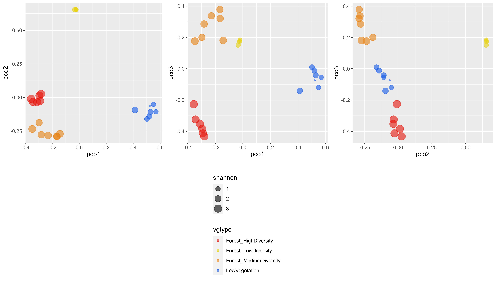

```{r setup, include = FALSE}
knitr::opts_chunk$set(
  collapse = TRUE,
  comment = "#>",
  eval=FALSE
)
options(rmarkdown.html_vignette.check_title = FALSE)
```

The following code performs computation of $\alpha$ and $\beta$ diversity from field plots and extracts the corresponding diversity indices from previouly computed `SpectralSpecies` raster in order to perform validation.

```{r alpha and beta diversity indices from vector layer}
# location of the directory where shapefiles used for validation are saved
VectorDir <- destunz
# list vector data
Path_Vector <- list_shp(VectorDir)
Name_Vector <- tools::file_path_sans_ext(basename(Path_Vector))
# location of the spectral species raster needed for validation
Path_SpectralSpecies <- Kmeans_info$SpectralSpecies
# get diversity indicators corresponding to shapefiles (no partitioning of spectral dibversity based on field plots so far...)
Biodiv_Indicators <- diversity_from_plots(Raster_SpectralSpecies = Path_SpectralSpecies, 
                                          Plots = Path_Vector,
                                          nbclusters = nbclusters, 
                                          Raster_Functional = PCA_Output$PCA_Files, 
                                          Selected_Features = Selected_Features)

Shannon_RS <- c(Biodiv_Indicators$Shannon)[[1]]
FRic <- c(Biodiv_Indicators$FunctionalDiversity$FRic)
FEve <- c(Biodiv_Indicators$FunctionalDiversity$FEve)
FDiv <- c(Biodiv_Indicators$FunctionalDiversity$FDiv)
# if no name for plots
Biodiv_Indicators$Name_Plot = seq(1,length(Biodiv_Indicators$Shannon[[1]]),by = 1)
```

The diversity indices corresponding to the plots can then be written in CSV files.

```{r Write validation}
# write a table for Shannon index
Path_Results <- file.path(Output_Dir,NameRaster,TypePCA,'VALIDATION')
dir.create(Path_Results, showWarnings = FALSE,recursive = TRUE)
write.table(Shannon_RS, file = file.path(Path_Results,"ShannonIndex.csv"),
            sep="\t", dec=".", na=" ", row.names = Biodiv_Indicators$Name_Plot, col.names= F,quote=FALSE)

# write a table for all spectral diversity indices corresponding to alpha diversity
Results <- data.frame(Name_Vector, Biodiv_Indicators$Richness, Biodiv_Indicators$Fisher,
                      Biodiv_Indicators$Shannon, Biodiv_Indicators$Simpson,
                      Biodiv_Indicators$FunctionalDiversity$FRic,
                      Biodiv_Indicators$FunctionalDiversity$FEve,
                      Biodiv_Indicators$FunctionalDiversity$FDiv)

names(Results)  = c("ID_Plot", "Species_Richness", "Fisher", "Shannon", "Simpson", "FRic", "FEve", "FDiv")
write.table(Results, file = file.path(Path_Results,"AlphaDiversity.csv"),
            sep="\t", dec=".", na=" ", row.names = F, col.names= T,quote=FALSE)

# write a table for Bray Curtis dissimilarity
BC_mean <- Biodiv_Indicators$BCdiss
colnames(BC_mean) <- rownames(BC_mean) <- Biodiv_Indicators$Name_Plot
write.table(BC_mean, file = file.path(Path_Results,"BrayCurtis.csv"),
            sep="\t", dec=".", na=" ", row.names = F, col.names= T,quote=FALSE)
```

These results can then be displayed according to the need for further analysis. 

Here, for the purpose of illustration, we provide a code in order to visualize the differences among field plots located in the image: we first perform a PCoA on the Bray Curtis dissimilarity matrix computed from the field plots:


```{r PCoA on Field Plots}
# apply ordination using PCoA (same as done for map_beta_div)
library(labdsv)
MatBCdist <- as.dist(BC_mean, diag = FALSE, upper = FALSE)
BetaPCO <- pco(MatBCdist, k = 3)
```

The plots corresponding to forested areas with high, medium and low diversity, as well as low vegetation/degraded forest close tomain roads are distributed as follows:

<p align="center">
  
</p>

Here, we produce figures in order to locate the different types of vegetation in the PCoA space:

```{r plot PCoA & Shannon}
# assign a type of vegetation to each plot, assuming that the type of vegetation 
# is defined by the name of the shapefile
library(terra)
library(tools)
library(ggplot2)
library(gridExtra)
nbSamples <- shpName <- c()
for (i in 1:length(Path_Vector)){
  shp <- Path_Vector[i]
  nbSamples[i] <- nrow(vect(shp))
  shpName[i] <- file_path_sans_ext(basename(shp))
}

Type_Vegetation = c()
for (i in 1: length(nbSamples)){
  for (j in 1:nbSamples[i]){
    Type_Vegetation = c(Type_Vegetation,shpName[i])
  }
}

# create data frame including a selection of alpha diversity metrics and beta diversity expressed as coordinates in the PCoA space
Results <- data.frame('vgtype'=Type_Vegetation,
                      'pco1'= BetaPCO$points[,1],
                      'pco2'= BetaPCO$points[,2],
                      'pco3' = BetaPCO$points[,3],
                      'shannon' = Shannon_RS,
                      'FRic' = FRic, 
                      'FEve' = FEve, 
                      'FDiv' = FDiv)

# plot field data in the PCoA space, with size corresponding to shannon index
g1 <-ggplot (Results, aes (x=pco1, y=pco2, color=vgtype,size=shannon)) + 
  geom_point(alpha=0.6) +
  scale_color_manual(values=c("#e6140a", "#e6d214", "#e68214", "#145ae6"))

g2 <-ggplot (Results, aes (x=pco1, y=pco3, color=vgtype,size=shannon)) + 
  geom_point(alpha=0.6) +
  scale_color_manual(values=c("#e6140a", "#e6d214", "#e68214", "#145ae6"))

g3 <-ggplot (Results, aes (x=pco2, y=pco3, color=vgtype,size=shannon)) + 
  geom_point(alpha=0.6) +
  scale_color_manual(values=c("#e6140a", "#e6d214", "#e68214", "#145ae6"))

#extract legend
#https://github.com/hadley/ggplot2/wiki/Share-a-legend-between-two-ggplot2-graphs
get_legend <- function(a.gplot){
  tmp <- ggplot_gtable(ggplot_build(a.gplot))
  leg <- which(sapply(tmp$grobs, function(x) x$name) == "guide-box")
  legend <- tmp$grobs[[leg]]
  return(legend)
}

legend <- get_legend(g3)
gAll <- grid.arrange(arrangeGrob(g1 + theme(legend.position="none"),
                                 g2 + theme(legend.position="none"),
                                 g3 + theme(legend.position="none"),
                                 nrow=1),legend,nrow=2,heights=c(5, 4))

filename <- file.path(Path_Results,'BetaDiversity_PcoA1_vs_PcoA2_vs_PcoA3.png')
ggsave(filename, plot = gAll, device = 'png', path = NULL,
       scale = 1, width = 12, height = 7, units = "in",
       dpi = 600, limitsize = TRUE)
```

The resulting figures are displayed here:

<p align="center">
  
</p>
