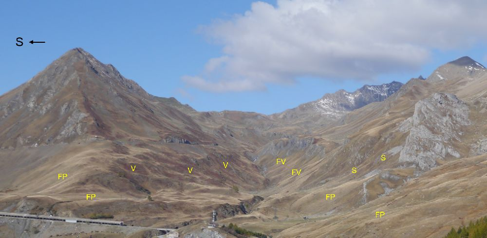
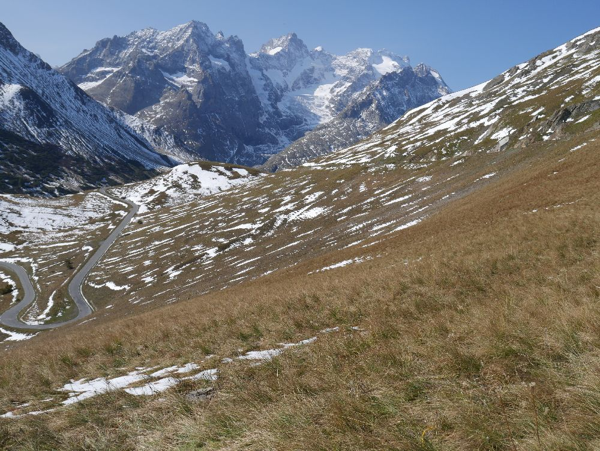
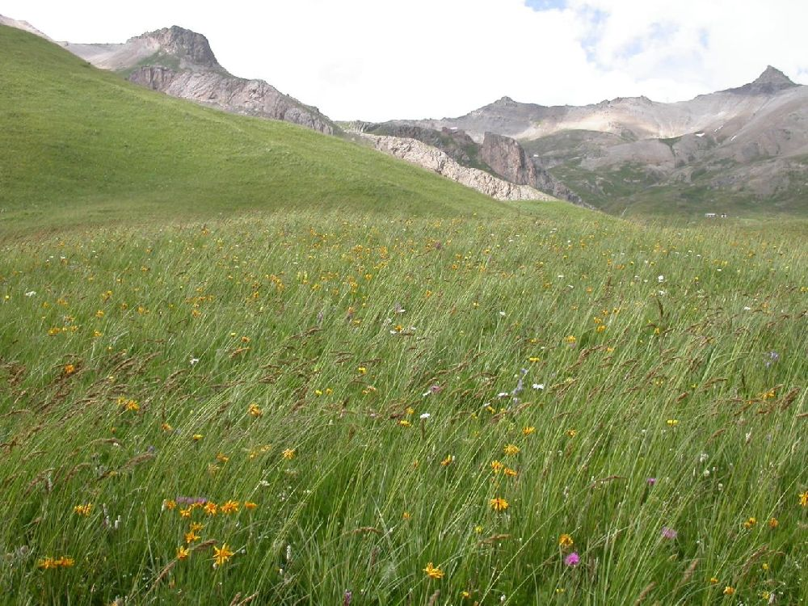
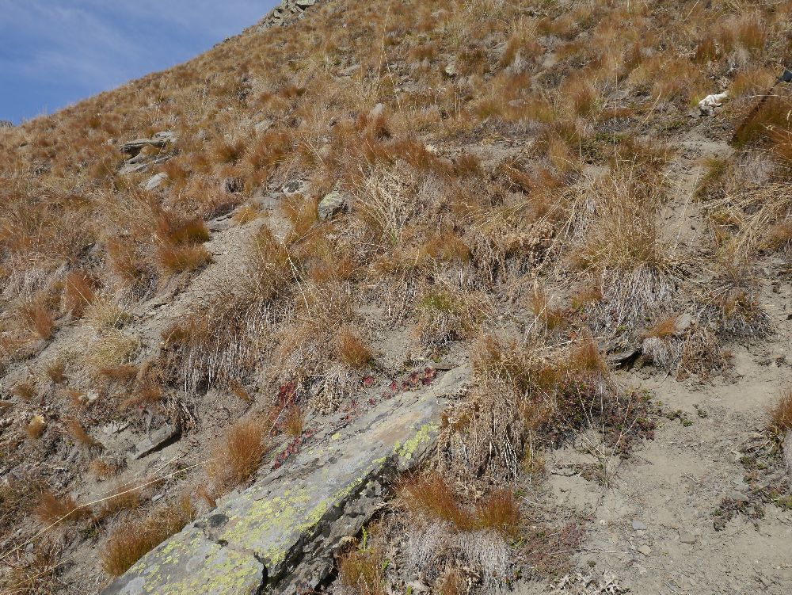
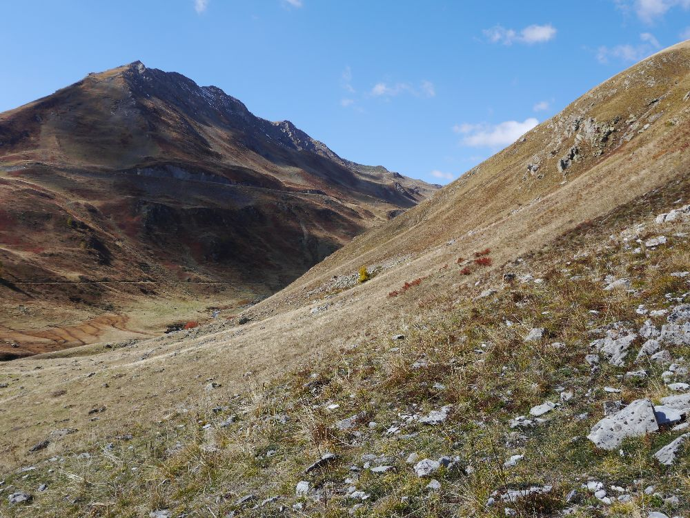
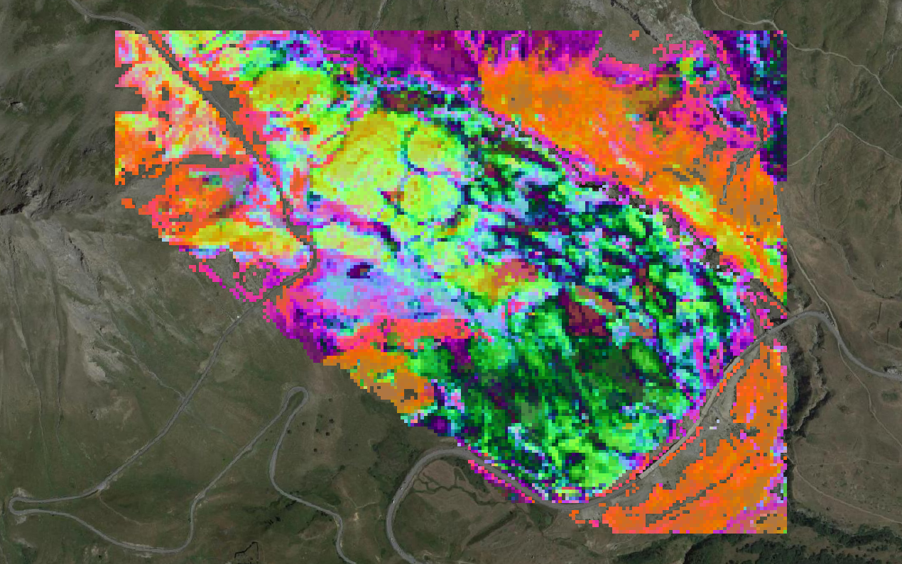
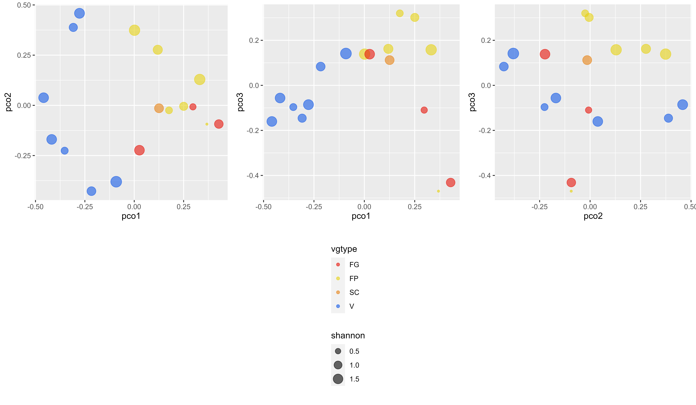

```{r setup, include = FALSE}
knitr::opts_chunk$set(
  collapse = TRUE,
  comment = "#>",
  eval=FALSE
)
options(rmarkdown.html_vignette.check_title = FALSE)
```

This tutorial illustrates how to run `biodivMapR` in order to map spectral diversity based on a set of spectral indices.

The study site (Roche Noire) is a high elevation watershed located next to the Lautaret pass (France, Hautes Alpes) in the south-western Alps. [N 45° 02′ 07″, E 6° 24′ 20″](https://fr.wikipedia.org/wiki/Col_du_Lautaret#/maplink/1)

More information about the study area and data used for this illustration can be found in [Pottier et al. (2014)](http://dx.doi.org/10.1098/rsbl.2014.0347).


## Download imaging spectroscopy data and corresponding ground plots

the image is available as a zip archive from a [gitlab repository](https://gitlab.com/jbferet/myshareddata/-/raw/master/Lautaret_HSI).

The image is an ENVI raster acquired with the dual Airborne Imaging Spectroradiometer for Applications (AISA; Specim Ltd., Finland) on July 23rd,  2008, including : 

* A binary file (which has no extension here).

* A header file (with __.hdr__ extension).

The header file is a text file including all necessary metadata which can be read with a text editor.
It includes image dimensions, projection, and the name and __central wavelength for each spectral band__.

```{r download HSI sample}
# load biodivMapR and useful libraries 
library(biodivMapR)
library(utils)
library(stars)
library(zip)
library(tools)

# directory where data will be downloaded
PathData <- '01_DATA'
dir.create(PathData,showWarnings = F)
# url for the zip file containing imaging spectroscopy data
url <- 'https://gitlab.com/jbferet/myshareddata/-/raw/master/Lautaret_HSI/ROCHENOIRE_HSI.zip'
# name zip file including plots located on the tile
destzip <- file.path(PathData,basename(url))
# download and unzip data
download.file(url = url, destfile = destzip)
ImDir <- file.path(PathData,'HSI_Lautaret')
unzip(zipfile = destzip,exdir = ImDir)
# define relative path for image name
ImName <- tools::file_path_sans_ext(list.files(ImDir,pattern = '.hdr'))
Input_Image_File <- file.path(ImDir,ImName)
```

Once opened in QGIS, the image should look like this: 

<p align="center">
  
</p>


* <span style=color:red;background-color:#999999> *FG : open subalpine grasslands dominated by Festuca violacea, mostly found on south-facing steep slopes* </span>.
* <span style=color:yellow;background-color:#999999> *FP : tall subalpine grasslands dominated by Patzkea paniculata (syn. Festuca paniculata), mostly found on south-facing gentle slopes with deep soil* </span>.
* <span style=color:orange;background-color:#999999> *SC : sparsely vegetated grasslands dominated by Sesleria caerulea on south-facing, debris-covered slopes* </span>.
* <span style=color:blue;background-color:#999999> *V: low stature heaths dominated by Vaccinium uliginosum and Vaccinium myrtillus, mostly found on north-facing slopes* </span>.


<p align="center">
  
  <em>Overview of the site</em>
</p>

<table>
  <tr>
    <th>Illustration of FP type</th>
    <th>Illustration of FP type</th>
  </tr>  
  <tr>
    <td>  </td>
    <td>  </td>
  </tr>
  <tr>
    <th>Illustration of V type</th>
    <th>Illustration of V type</th>
  </tr>
  <tr>
    <td>  </td>
    <td>  </td>
  </tr>
  <tr>
    <th>Illustration of FV type</th>
    <th>Illustration of S type</th>
  </tr>
  <tr>
    <td>  </td>
    <td>  </td>
  </tr>
</table>


## Compute spectral indices from imaging spectroscopy

The computation of spectral indices can be performed with the package `spinR`. Please refer to the [homepage](https://gitlab.com/jbferet/spinr) and follow instructions for installation. 

### Load additional libraries and prepare data for computation

We will first read the imaging spectroscopy raster with the `raster` package. We will also get the central wavelength corresponding to each spectral band in the file from the __header file__, which is critical for the automated computation of spectral indices.

```{r load libraries and read image}
library(spinR) # https://gitlab.com/jbferet/spinr
library(stars)
library(raster)
# 
ImBrick <- raster::brick(Input_Image_File)
HDR <- read_ENVI_header(get_HDR_name(Input_Image_File))
SensorBands <- HDR$wavelength
```


### Computation of spectral indices

We select a set of spectral indices identified as relevant for the estimation of various vegetation traits. 

These spectral indices and the corresponding leaf traits are the following ones:

** TCARI/OSAVI ([Haboudane et al. (2002)](https://doi.org/10.1016/S0034-4257(02)00018-4)), which is supposed to be related to leaf chlorophyll content. 

** ND_LMA ([le Maire et al. (2008)](https://doi.org/10.1016/j.rse.2008.06.005)), which is supposed to be related to Leaf Mass per Area (LMA). 

** CR_SWIR (Féret, 2020 - unpublished), which is supposed to be related to Equivalent Water Thickness (EWT). 

The NDVI is also computed in order to mask non vegetated pixels based on a simple tresholding.

Here, we are using the function `ComputeSpectralIndices_fromExpression` to compute spectral indices based on an expression.

```{r Compute spectral indices}
ReflFactor <- 10000 # using reflectance data coded in Int16 between 0 and 10000

#############################       NDVI     ###################################
# 1- Define the expression corresponding to the spectral index
Expression_NDVI <- '(B2-B1)/(B2+B1)'
# 2- Define the spectral bands corresponding to bands in the spectral index, 
# identified as BXX, with XX the number of the band
Bands_NDVI <- list()
Bands_NDVI[['B1']] <- 665
Bands_NDVI[['B2']] <- 835
# 3- Compute the spectral indices
NDVI <- spinR::compute_SI_fromExp(Refl = ImBrick, 
                                  SensorBands = SensorBands, 
                                  ExpressIndex = Expression_NDVI, 
                                  listBands = Bands_NDVI, 
                                  ReflFactor = ReflFactor, 
                                  NameIndex = 'NDVI')

#############################   TCARI/OSAVI   ##################################
# _______________                     TCARI                     ________________
# 1- spectral bands to be used
Bands_TCARI <- list()
Bands_TCARI[['B1']] <- 700
Bands_TCARI[['B2']] <- 670
Bands_TCARI[['B3']] <- 550
# 2- Formula for the index
Formula_TCARI <- '3*(B1-B2-0.2*(B1-B3)*(B1/B2))'
# 3- application of spectral index on image
TCARI <- spinR::compute_SI_fromExp(Refl = ImBrick, 
                                   SensorBands = SensorBands,
                                   ExpressIndex = Formula_TCARI, 
                                   listBands = Bands_TCARI,
                                   ReflFactor = ReflFactor,
                                   NameIndex = 'TCARI')

# _______________                     OSAVI                     ________________
# 1- spectral bands to be used
Bands_OSAVI <- list()
Bands_OSAVI[['B1']] <- 800
Bands_OSAVI[['B2']] <- 700
Bands_OSAVI[['B3']] <- 670
# 2- Formula for the index
Formula_OSAVI <- '1.16*(B1-B3)/(B2+B3-0.16)'
# 3- application of spectral index on image
OSAVI <- spinR::compute_SI_fromExp(Refl = ImBrick, 
                                   SensorBands = SensorBands,
                                   ExpressIndex = Formula_OSAVI, 
                                   listBands = Bands_OSAVI,
                                   ReflFactor = ReflFactor,
                                   NameIndex = 'OSAVI')

# _______________             Compute TCARI/OSAVI             _________________
message('computing TCARI/OSAVI')
TCARI_OSAVI <- TCARI/OSAVI
names(TCARI_OSAVI) <- 'TCARI_OSAVI'

#############################       CR_SWIR     ##################################
# 1- The expression for computation of continuum removal is already coded in spinR
# 2- Define the spectral bands corresponding to bands in the spectral index
Bands_CR_SWIR <- list()
Bands_CR_SWIR[['CRmin']] <- 1150
Bands_CR_SWIR[['CRmax']] <- 2200
Bands_CR_SWIR[['target']] <- 1550
# 3- Compute the spectral indices
CR_SWIR <- spinR::CR_WL(Refl = ImBrick, 
                        SensorBands = SensorBands,
                        CRbands = Bands_CR_SWIR, 
                        ReflFactor = ReflFactor)
CR_SWIR <- CR_SWIR[[1]]

#############################       ND_LMA     ##################################
# 1- Define the expression corresponding to the spectral index
Expression_ND_LMA <- '(B2-B1)/(B2+B1)'
# 2- Define the spectral bands corresponding to bands in the spectral index
Bands_ND_LMA <- list()
Bands_ND_LMA[['B1']] <- 1490
Bands_ND_LMA[['B2']] <- 2260
# 3- Compute the spectral indices
ND_LMA <- spinR::CR_WL(Refl = ImBrick, 
                       SensorBands = SensorBands, 
                       ExpressIndex = Expression_ND_LMA, 
                       listBands = Bands_ND_LMA, 
                       ReflFactor = ReflFactor, 
                       NameIndex = 'ND_LMA')

#############################       ANCB      ##################################
message('computing ANCB')
AUCminmax <- list()
AUCminmax[['CRmin']] <- 650
AUCminmax[['CRmax']] <- 720
ANCB <- spinR::AUC(Refl = ImBrick, 
                   SensorBands = SensorBands, 
                   AUCminmax = AUCminmax, 
                   ReflFactor = ReflFactor)
AUCminmax[['target']] <- 670
ANCB <- ANCB/(1-spinR::CR_WL(Refl = ImBrick, 
                             SensorBands = SensorBands,
                             CRbands = AUCminmax, 
                             ReflFactor = ReflFactor)[[1]])
```

Once computed, we we perform interquartile analysis on these spectral indices in order to mask outliers. 

Then we write these indices as individual raster files. 


```{r Write Indices}

## Save these spectral indices as raster files
NameIndices <- c("NDVI", "TCARI_OSAVI", "CR_SWIR", "ND_LMA", "ANCB")
# directory where data will be downloaded
PathOut <- '03_RESULTS'
dir.create(PathOut,showWarnings = F)

Index_Path <- list()
for (SI in NameIndices){
  # first exclude outliers and Inf values
  IQRminmax <- IQR_outliers(DistVal = values(eval(parse(text =  SI))))
  eval(parse(text = paste(parse(text =  SI),'[',parse(text =  SI),'<IQRminmax[1] | ',
                          parse(text =  SI),'>IQRminmax[2]] <- NA',sep = '')))
  Index_Path[[SI]] <- file.path(PathOut,paste('HSI_Lautaret_',SI,sep = ''))
  stars::write_stars(st_as_stars(eval(parse(text =  SI))), dsn=Index_Path[[SI]], driver =  "ENVI",type='Float32')
  # write band name in HDR
  HDR <- read_ENVI_header(get_HDR_name(Index_Path[[SI]]))
  HDR$`band names` <- SI
  write_ENVI_header(HDR = HDR,HDRpath = get_HDR_name(Index_Path[[SI]]))
}
```

The following figure displays a color composition of three indices:

* <span style="color:red"> *__TCARI/OSAVI__* </span>.

* <span style="color:green"> *__CR_SWIR__* </span>.

* <span style="color:blue"> *__ANCB__* </span>.
 

<p align="center">
  
</p>


### Correlation analysis of spectral indices

The correlation between spectral indices can be performed.

```{r Analyze correlations}
library(corrplot)
# 1- create a data.frame from all spectral indices
df_Indices <- data.frame('TCARI_OSAVI' = raster::values(TCARI_OSAVI), 'CR_SWIR' = raster::values(CR_SWIR), 
                         'ND_LMA' = raster::values(ND_LMA), 'ANCB' = raster::values(ANCB))

# 2- create a list of raster objects
Spectral_Indices <- list()
Spectral_Indices[['TCARI_OSAVI']] <- TCARI_OSAVI
Spectral_Indices[['CR_SWIR']] <- CR_SWIR
Spectral_Indices[['ND_LMA']] <- ND_LMA
Spectral_Indices[['ANCB']] <- ANCB

M <- cor(df_Indices,use = 'complete.obs')
corrplot(M, method = 'ellipse', order = 'AOE', type = 'upper')
```


## Stacking and writing spectral indices in format expected by biodivMapR

Once the spectral indices are computed, they will be stacked and written in __ENVI format with [BIL interleaves](https://bitbucket.org/hu-geomatics/enmap-box-idl/wiki/Data%20Format%20Definition){target="_blank"}__.

### Mask data from spectral indices and apply the mask on spectral indices

```{r Produce mask based on IQR and apply it on spectral indices}
# stack spectral indices
Index_Path[['NDVI']] <- NULL
Mask <- 0*NDVI+1
names(Mask) <- 'Mask'
StarsObj <- read_ListRasters(Index_Path)

# remove outliers from spectral indices
for (SI in names(Spectral_Indices)){
  rast <- Spectral_Indices[[SI]]
  IQRminmax <- IQR_outliers(DistVal = raster::values(rast),weightIRQ = 3)
  Mask[rast<IQRminmax[1] | rast>IQRminmax[2] | is.na(rast)] <- NA
}
Mask[NDVI<0.5] <- NA
# apply mask on stack and convert as stars object
StarsObj <- st_as_stars(as(object = StarsObj,Class = 'Raster')*Mask)
```

### Save Mask file and spectral indices as raster stack


```{r Save files}
# save mask in raster file
Input_Mask_File <- file.path(PathOut,'Mask')
stars::write_stars(st_as_stars(Mask), dsn=Input_Mask_File, driver =  "ENVI",type='Byte')

# define path where to store spectral indices (same as root path for biodivMapR output directory)
NameRaster <- 'HSI_Lautaret'
NameStack <- paste(NameRaster,'_StackIndices',sep = '')
# save Stack of spectral indices in raster file with spectral indices defining band names
Path_StackIndices <- file.path(PathData,NameStack)
biodivMapR::write_StarsStack(StarsObj = StarsObj, 
                             dsn = Path_StackIndices, 
                             BandNames = names(Index_Path), 
                             datatype = 'Float32')
```

## Run biodivMapR on a raster stack

### Set parameters for biodivMapR

```{r Parameterize biodivMapR}
# see additional information here
# https://jbferet.github.io/biodivMapR/articles/biodivMapR_02.html

# Define path for original image file to be processed
Input_SIstack_File <- Path_StackIndices
# trick to define the same directory as PathIndices defined in previous chunk
TypePCA <- 'noPCA'
# Define path for master output directory where files produced during the process are saved 
Output_Dir <- PathOut
# window size forcomputation of spectral diversity
window_size <- 10
# computational parameters
nbCPU <- 4
MaxRAM <- 0.5
# number of clusters (spectral species)
nbclusters <- 50

# use 10% of image to sample pixels and partition it in 20 runs of kmeans
NbPix <- sum(Mask[,,,1],na.rm = T)
nb_partitions <- 20
Pix_Per_Partition <- round(0.1*NbPix/nb_partitions)
```

### Perform Spectral species mapping

```{r Perform Spectral species mapping}
# https://jbferet.github.io/biodivMapR/articles/biodivMapR_05.html
print("MAP SPECTRAL SPECIES")
# select all spectral indices
SelectedPCs <- seq(1,dim(raster::stack(Input_SIstack_File))[3])
SpectralSpace_Output <- list('PCA_Files' = Input_SIstack_File, 
                             'TypePCA' = TypePCA)

Kmeans_info <- map_spectral_species(Input_Image_File = Input_SIstack_File, 
                                    Input_Mask_File = Input_Mask_File,
                                    Output_Dir = Output_Dir,
                                    SpectralSpace_Output = SpectralSpace_Output, 
                                    nbclusters = nbclusters, 
                                    nbCPU = nbCPU, MaxRAM = MaxRAM, 
                                    SelectedPCs = SelectedPCs)
```

### Map diversity indices

```{r Map diversity indices}
# https://jbferet.github.io/biodivMapR/articles/biodivMapR_06.html
print("MAP ALPHA DIVERSITY")
Index_Alpha <- c('Shannon')
map_alpha_div(Input_Image_File = Input_SIstack_File, 
              Input_Mask_File = Input_Mask_File, 
              Output_Dir = Output_Dir, 
              TypePCA = TypePCA,
              window_size = window_size, 
              nbCPU = nbCPU, 
              MaxRAM = MaxRAM,
              Index_Alpha = Index_Alpha, 
              nbclusters = nbclusters)

print("MAP BETA DIVERSITY")
map_beta_div(Input_Image_File = Input_SIstack_File, 
             Output_Dir = Output_Dir, 
             TypePCA = TypePCA,
             window_size = window_size, 
             nbCPU = nbCPU, 
             MaxRAM = MaxRAM,
             nbclusters = nbclusters)

# print("MAP FUNCTIONAL DIVERSITY")
# https://jbferet.github.io/biodivMapR/articles/biodivMapR_07.html
# Villeger et al, 2008 https://doi.org/10.1890/07-1206.1
# map_functional_div(Original_Image_File = Input_SIstack_File, 
#                    Functional_File = Input_SIstack_File,
#                    Selected_Features = SelectedPCs, 
#                    Output_Dir = Output_Dir,
#                    window_size = window_size, 
#                    nbCPU = nbCPU, 
#                    MaxRAM = MaxRAM,
#                    TypePCA = TypePCA)
```

The map corresponding to beta-diversity (based on a principal coordinate analysis applied to Bray Curts dissimilarity matrix) is displayed hereafter:

<p align="center">
  
</p>


### Perform validation based on a vectorized plot network

First, the zip file containing the shapefile with field plots needs to be downloaded from the repository and unzipped.

```{r download field plots}
# url for the zip file containing imaging spectroscopy data
url <- 'https://gitlab.com/jbferet/myshareddata/-/raw/master/Lautaret_HSI/ROCHENOIRE_PLOTS.zip'
# name zip file including plots located on the tile
destzip <- file.path(PathData,basename(url))
# download and unzip data
download.file(url = url, destfile = destzip)
unzip(zipfile = destzip,exdir = PathData)
VectorDir <- file.path(PathData,file_path_sans_ext(basename(url)))
```

Then the validation can be performed.

The same procedure as in the [previous tutorial](https://jbferet.github.io/biodivMapR/articles/biodivMapR_08.html){target="_blank"} can be applied.

```{r Perform Validation}
# list vector data
Path_Vector <- list_shp(VectorDir)
Name_Vector <- tools::file_path_sans_ext(basename(Path_Vector))
NamePlots <- rgdal::readOGR(VectorDir,Name_Vector,verbose = FALSE)$ID
# location of the spectral species raster needed for validation
Path_SpectralSpecies <- Kmeans_info$SpectralSpecies
# get diversity indicators corresponding to shapefiles (no partitioning of spectral dibversity based on field plots so far...)
Biodiv_Indicators <- diversity_from_plots(Raster_SpectralSpecies = Path_SpectralSpecies, Plots = Path_Vector, 
                                          nbclusters = nbclusters, Raster_Functional = FALSE, 
                                          Selected_Features = SelectedPCs, Name_Plot = NamePlots)

# identify which plots were in the image
WhichPlots <- which(!is.na(Biodiv_Indicators$Shannon) & !Biodiv_Indicators$Shannon==0)
NamePlot <- Biodiv_Indicators$Name_Plot[WhichPlots]
TypeCommunity <- rgdal::readOGR(VectorDir,Name_Vector,verbose = FALSE)$COMM[WhichPlots]

Richness_RS <- Biodiv_Indicators$Richness[[1]][WhichPlots]
Shannon_RS <- Biodiv_Indicators$Shannon[[1]][WhichPlots]

# write a table for Shannon index
Path_Results <- file.path(Output_Dir,NameStack,TypePCA,'VALIDATION')
dir.create(Path_Results, showWarnings = FALSE,recursive = TRUE)

# write a table for all spectral diversity indices corresponding to alpha diversity
Results <- data.frame('ID_Plot'=NamePlot, 'Species_Richness'=Richness_RS, 'Shannon'=Shannon_RS)
write.table(Results, file = file.path(Path_Results,"AlphaDiversity.csv"),
            sep="\t", dec=".", na=" ", row.names = F, col.names= T,quote=FALSE)

# write a table for Bray Curtis dissimilarity
BC_mean <- Biodiv_Indicators$BCdiss[WhichPlots,WhichPlots]
colnames(BC_mean) <- rownames(BC_mean) <- NamePlot
write.table(BC_mean, file = file.path(Path_Results,"BrayCurtis.csv"),
            sep="\t", dec=".", na=" ", row.names = F, col.names= T,quote=FALSE)

# apply ordination using PCoA (same as done for map_beta_div)
MatBCdist <- as.dist(BC_mean, diag = FALSE, upper = FALSE)
BetaPCO <- labdsv::pco(MatBCdist, k = 3)

# assign a type of vegetation to each plot
NameCommunity <-unique(TypeCommunity)

# create data frame including a selection of alpha diversity metrics and beta diversity expressed as coordinates in the PCoA space
Results <- data.frame('vgtype'=TypeCommunity,
                      'pco1'= BetaPCO$points[,1],'pco2'= BetaPCO$points[,2],'pco3' = BetaPCO$points[,3],
                      'shannon'=Shannon_RS)

library(ggplot2)
library(gridExtra)

# plot field data in the PCoA space, with size corresponding to shannon index
g1 <-ggplot (Results, aes (x=pco1, y=pco2, color=vgtype,size=shannon)) + 
  geom_point(alpha=0.6) +
  scale_color_manual(values=c("#e6140a", "#e6d214", "#e68214", "#145ae6"))

g2 <-ggplot (Results, aes (x=pco1, y=pco3, color=vgtype,size=shannon)) + 
  geom_point(alpha=0.6) +
  scale_color_manual(values=c("#e6140a", "#e6d214", "#e68214", "#145ae6"))

g3 <-ggplot (Results, aes (x=pco2, y=pco3, color=vgtype,size=shannon)) + 
  geom_point(alpha=0.6) +
  scale_color_manual(values=c("#e6140a", "#e6d214", "#e68214", "#145ae6"))

#extract legend
#https://github.com/hadley/ggplot2/wiki/Share-a-legend-between-two-ggplot2-graphs
get_legend <- function(a.gplot){
  tmp <- ggplot_gtable(ggplot_build(a.gplot))
  leg <- which(sapply(tmp$grobs, function(x) x$name) == "guide-box")
  legend <- tmp$grobs[[leg]]
  return(legend)
}

legend <- get_legend(g3)
gAll <- grid.arrange(arrangeGrob(g1 + theme(legend.position="none"),
                                 g2 + theme(legend.position="none"),
                                 g3 + theme(legend.position="none"),
                                 nrow=1),legend,nrow=2,heights=c(5, 4))

filename <- file.path(Path_Results,'BetaDiversity_PcoA1_vs_PcoA2_vs_PcoA3.png')
ggsave(filename, plot = gAll, device = 'png', path = NULL,
       scale = 1, width = 12, height = 7, units = "in",
       dpi = 600, limitsize = TRUE)


library(ggplot2)
# plot field data in the PCoA space, with size corresponding to shannon index
ggplot(Results, aes(x=pco1, y=pco2, color=vgtype,size=shannon)) +
  geom_point(alpha=0.6) +
  scale_color_manual(values=c("#e6140a", "#e6d214", "#e68214", "#145ae6"))
filename = file.path(Path_Results,'BetaDiversity_PcoA1_vs_PcoA2.png')
ggsave(filename, plot = last_plot(), device = 'png', path = NULL,
       scale = 1, width = 6, height = 4, units = "in",
       dpi = 600, limitsize = TRUE)

ggplot(Results, aes(x=pco1, y=pco3, color=vgtype,size=shannon)) +
  geom_point(alpha=0.6) +
  scale_color_manual(values=c("#e6140a", "#e6d214", "#e68214", "#145ae6"))
filename = file.path(Path_Results,'BetaDiversity_PcoA1_vs_PcoA3.png')
ggsave(filename, plot = last_plot(), device = 'png', path = NULL,
       scale = 1, width = 6, height = 4, units = "in",
       dpi = 600, limitsize = TRUE)

ggplot(Results, aes(x=pco2, y=pco3, color=vgtype,size=shannon)) +
  geom_point(alpha=0.6) +
  scale_color_manual(values=c("#e6140a", "#e6d214", "#e68214", "#145ae6"))
filename = file.path(Path_Results,'BetaDiversity_PcoA2_vs_PcoA3.png')
ggsave(filename, plot = last_plot(), device = 'png', path = NULL,
       scale = 1, width = 6, height = 4, units = "in",
       dpi = 600, limitsize = TRUE)

```


The resulting figures are displayed below.

<p align="center">
  
</p>


This data acquisition was initiated and supported by the European [ECOCHANGE project](https://cordis.europa.eu/project/id/36866) (GOCE-CT-2007-036866) and the Swiss National Science Foundation ([BIOASSEMBLE](https://p3.snf.ch/Project-125145), 31003A-125145).
